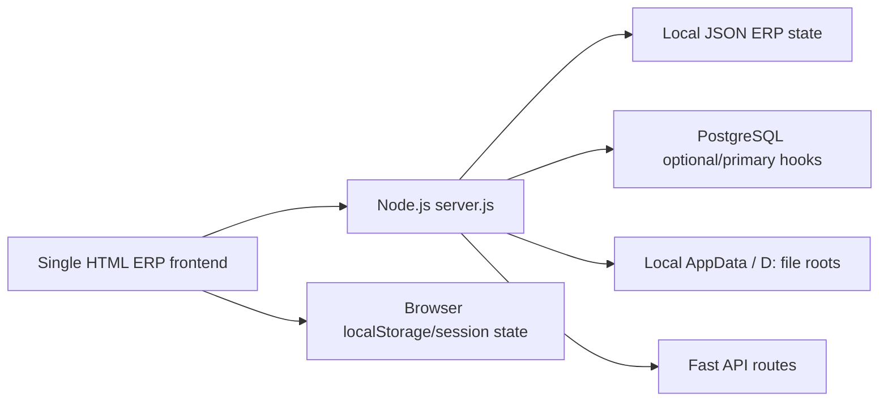
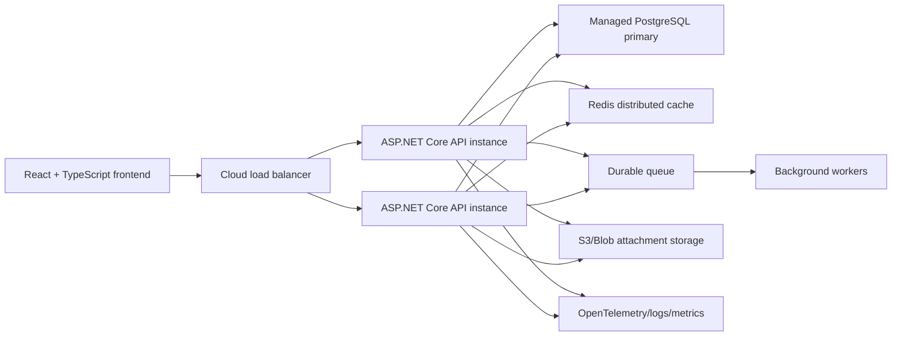

# SESS NexaERP Architecture Gap Report

Date: 2026-08-08
Current frozen version: REV861

## Current Architecture Diagram

## Current Technology Inventory

- Frontend: one large `InventoryERP_Software.html` file with embedded CSS and JavaScript.
- Backend: Node.js server in `server.js`.
- Runtime: bundled Node plus local Windows start scripts.
- Database: PostgreSQL support exists, but local JSON/browser storage dependencies still exist.
- File storage: local file roots with S3-style configuration hooks.
- Current workspace: newly initialized Git repository with a frozen REV861 source snapshot.
- Local SDK check: installed .NET SDK is `8.0.129`; approved target is .NET 10 LTS, so .NET 10 SDK installation is still required before build/test of target implementation.

## Current Frontend Structure

- Single HTML file acts as page router, UI, business logic and local persistence layer.
- Modules/pages are embedded as `<section>` elements.
- Several pages are complete forms; some are dynamic placeholder shells.
- Large registers are mostly browser-rendered, which is not acceptable for high-volume production.
- Business-authoritative data still appears in browser/local state paths in some flows.

## Current Backend Structure

- Single `server.js` contains startup, API routing, PostgreSQL helpers, JSON state handling, auth, file-store hooks, stock movement, approval APIs and route handlers.
- Stronger areas already present:
  - login and user APIs
  - approval workflow records
  - stock movement ledger
  - purchase flow status
  - fast master APIs
  - file-store health/retention hooks
- Gap: modular boundaries are not separated into maintainable ASP.NET Core modules yet.

## Existing PostgreSQL Schema and Tables Found

Observed in `server.js`:

- `erp_db_state`
- `items`
- `vendors`
- `customers`
- `purchase_requests`
- `purchase_orders`
- `grn_lines`
- `dc_lines`
- `stock_movements`
- `purchase_flow_status`
- `approval_workflow_records`
- `erp_company_ledger_records`
- `page_form_records`
- `simple_master_records`
- `project_ledger_records`
- `work_register_records`
- `service_ledger_records`
- `vendor_rating_records`

## Current Local JSON Dependencies

- `erp_db_state`/company JSON state is still used as a broad state container.
- Browser localStorage remains part of session and some workflow persistence/fallback behavior.
- Some page-ledger records are generic JSON payloads rather than normalized relational tables.

## Current Local File Storage Dependencies

- Local AppData installed app/server folders.
- Data roots shown by health endpoint:
  - `D:\SESS_NEXA_ERP_DATA`
  - `D:\SESS_NEXA_ERP_DATA\departments`
  - `D:\SESS_NEXA_ERP_DATA\auto-save-backups`
  - local uploads/exports/evidence roots.
- S3 configuration hooks exist, but production attachment storage is not yet proven.

## Existing Authentication and Permission Design

- User records and default role users exist.
- Backend user maintenance APIs are guarded for TD/MD/IT/admin roles.
- Role portal UI and role access audit exist.
- Approval portal backend checks current approver role for approval actions.
- Gap: not every embedded page action has a dedicated backend authorization policy and transaction endpoint yet.

## Business Logic To Preserve

- Company selection and revision visibility.
- User login and role portal routing.
- Item, Vendor, Customer, Employee masters.
- Purchase PR -> RFQ -> Quote -> Compare -> PO -> Confirmation flow.
- Store GRN, Receive, DC, Stock Ledger, Stock Adjustment, Material Issue/Return and Actual BOM flows.
- Approval workflow records and portal pending actions.
- Stock movement ledger and negative-stock approval reference behavior.
- Backup/import/export and file-store health controls.
- Existing reports, dashboards, audit logs and role-specific page visibility.

## Scalability Blockers

- Single HTML file loads too much UI/business logic into the browser.
- Local JSON/browser storage cannot be authoritative for production.
- Some APIs still expose broad records rather than paginated module APIs.
- One Windows/AppData runtime is not horizontally scalable.
- Large tables need server-side pagination, indexing and query monitoring.
- Long-running reports/exports need background jobs.

## Security Blockers

- Production identity needs OIDC/OAuth2 and MFA for privileged roles.
- Backend/API authorization must cover every page action, not just hidden menus.
- Customer/vendor record isolation must be enforced in backend queries.
- Secrets must move to a cloud secret manager.
- Production WAF, TLS, rate limiting, lockout and suspicious-login monitoring are required.

## Data-Loss and Concurrency Risks

- Local JSON/browser fallback can diverge from PostgreSQL.
- Stock and approval actions must be wrapped in PostgreSQL transactions.
- Idempotency keys and optimistic concurrency fields are needed for duplicate/double-click prevention.
- File attachments need checksums, versioning, signed access and malware scanning.

## Recommended Target Architecture

## Production Classification

Current REV861 must be classified as current/prototype ERP functionality. It is not approved as final production architecture for 900,000 registered identities or high concurrent internet use until migrated, secured and load-tested.

