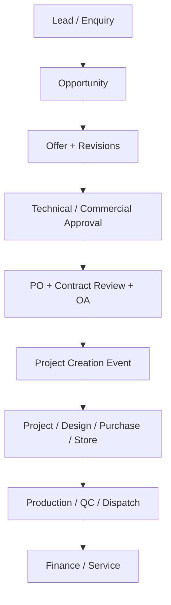

> Copied from SESS_CRM_ERP_Integration_Blueprint_V2.md (SHA-256 A849ED9838AF630BD0806728A29D68FB434E92678D768231A18930E1608916EF) on 27 September 2026.

# SESS CRM → ERP Integration Blueprint (V2)

## Verdict

**APPROVED WITH CORRECTIONS** for use as a controlled transitional CRM. It is **not yet approved as the final ERP Sales module** because Google Sheets is not the final system of record, backend row-level security is limited, formal TD/MD approval evidence is incomplete, and project/finance handoff is not yet connected to PostgreSQL.

## 1. Process understood

Lead / Enquiry → Requirement Clarification → Technical Review → Offer Preparation → Commercial Approval → Offer Submission → Follow-up → Negotiation / Final → Won or Lost.

When Won: PO receipt → Contract Review → OA → Project creation → Design / Purchase / Store / Production / QC / Dispatch / Finance / Service.

The same customer, contact, opportunity and offer must be created once and reused. A revision creates a new `offer_revision`; it must not overwrite the earlier commercial record.

## 2. What the first upgrade was missing

| Area | Missing / risk | ERP-ready correction |
|---|---|---|
| Primary key | Offer number used like a database key | Add immutable UUID to every entity; keep offer number as a business number |
| Customer master | Customer details repeated in every offer row | Separate `customers` and `contacts`; opportunity stores `customer_id` |
| Offer revisions | Original/revised/current values kept in one row | Separate `offers` and `offer_revisions`; preserve every revision |
| Workflow | Stage editable directly | Controlled transition rules with mandatory remarks/evidence |
| Approval | No independent technical/commercial approval records | Add approval request, approver, decision, remarks, timestamp and version |
| Ownership | Sales owner stored as free text | Store `owner_user_id`; roles only provide permission groups |
| Audit | Last Updated is insufficient | Immutable audit log with before/after JSON, user, timestamp and request ID |
| Deletion | Sheet rows can be deleted | No hard delete; use Active/Cancelled/Archived with reason |
| Handoff | Won does not automatically create next tasks | Create outbox event `sales.opportunity_won`; ERP consumes it after PO + Contract Review + OA |
| Integration | UI calls sheet functions directly | Versioned service/API contract: `/api/v1/...` |
| Duplicate control | Only Offer ID duplicate check | Also customer GSTIN/email/domain and enquiry reference duplicate checks |
| Concurrency | Last writer can overwrite another user | Add `record_version` and reject stale updates |
| Attachments | No controlled document registry | Add attachment metadata, category, version, checksum, uploader and replacement history |
| Security | Frontend visibility is the main control | Backend role + record-scope checks on every read/write/API action |
| Retention | Three-year dashboard focus may be mistaken for deletion | Dashboard shows 3 years; ERP retains controlled records for 10+ years |
| Failure recovery | No integration retry ledger | Add Integration Outbox with pending/sent/failed/retry/dead-letter states |

## 3. Canonical data model

| Entity | Purpose | Key relationships |
|---|---|---|
| `customers` | One customer master | Has many contacts/opportunities/machines/projects |
| `contacts` | Customer people | Belongs to one customer |
| `opportunities` | One enquiry / commercial opportunity | Belongs to customer; owned by employee/user |
| `offers` | Business offer number and overall state | Belongs to opportunity |
| `offer_revisions` | R0, R1, R2… commercial snapshots | Belongs to offer; immutable after submission |
| `activities` | Calls, emails, meetings and next actions | Belongs to opportunity |
| `approvals` | Technical/commercial approval decisions | References entity + version |
| `attachments` | Controlled documents | Polymorphic entity reference and document version |
| `status_history` | Every status transition | Entity, from/to status, actor, remarks |
| `audit_log` | Every material create/change/access denial | Before/after JSON and request ID |
| `integration_outbox` | Reliable ERP handoff | Event payload, attempts and result |
| `users/roles/permissions` | Backend authorization | User → role mappings → permissions |

## 4. Ownership and permissions

| Action | Sales User | Sales Manager | TD | MD | Accounts | Admin/IT |
|---|---:|---:|---:|---:|---:|---:|
| Create enquiry/opportunity | Yes | Yes | View | View | View | Support only |
| Edit assigned open opportunity | Own scope | Team scope | View/technical fields | View | No | No business edit |
| Technical approval | No | Recommend | Approve/Reject/Revise | View | No | No |
| Commercial approval | No | Recommend | Conditional | Approve/Reject/Revise | View | No |
| Mark Won | Submit evidence | Verify | Verify technical commitment | Final commercial control | View | No |
| Create project | No | No | Approve gate | Approve gate | View | No |
| Export commercial register | Restricted | Team scope | Yes | Yes | Approved scope | Config only |
| Cancel/reverse | Request | Recommend | Approve | Approve | View | No |
| Permanent delete | Never | Never | Never | Never | Never | Never |

Every page, direct URL and API endpoint must check permission and record scope. Hiding a button is not authorization.

## 5. Workflow and approval rules

Recommended opportunity states:

`DRAFT → QUALIFICATION → REQUIREMENT_CLARIFICATION → TECHNICAL_REVIEW → OFFER_PREPARATION → APPROVAL_PENDING → OFFER_SUBMITTED → FOLLOW_UP → NEGOTIATION → FINAL → WON / LOST / ON_HOLD / CANCELLED`

Rules:

- `DRAFT → QUALIFICATION`: customer, contact, requirement, owner and enquiry source required.
- `OFFER_PREPARATION → APPROVAL_PENDING`: scope, quantity, technical configuration, commercial value, delivery, warranty, validity and revision required.
- Technical deviation or non-standard design: TD approval required.
- Discount, payment term exception, credit risk or special warranty: configurable approval matrix; MD final approval where applicable.
- `FINAL → WON`: PO number/date/value, PO attachment, contract review and OA status required.
- Project creation is permitted only after PO + Contract Review + OA.
- Lost requires reason, competitor if known, remarks and loss date.
- Rejection and revision always require remarks and create a new history entry.

## 6. Numbering and versioning

- `opportunity_no`: `SESS-OPP-26-000001`
- `offer_no`: `SESS-OFR-26-000001`
- `revision_no`: `R0`, `R1`, `R2` — never overwrite earlier revisions.
- Database identity: UUID; numbers are unique business identifiers, not primary keys.
- `record_version` increments on update. API update must send `expected_version`; stale updates return HTTP 409.

## 7. ERP API contract

Base path: `/api/v1`

| Method | Endpoint | Purpose |
|---|---|---|
| `POST` | `/customers` | Create customer with duplicate checks |
| `GET` | `/customers?search=` | Search master before creating |
| `POST` | `/opportunities` | Create enquiry once |
| `GET` | `/opportunities/{id}` | Full opportunity view |
| `PATCH` | `/opportunities/{id}` | Version-controlled update |
| `POST` | `/opportunities/{id}/transition` | Controlled stage change |
| `POST` | `/offers` | Create offer under opportunity |
| `POST` | `/offers/{id}/revisions` | Create immutable revision |
| `POST` | `/approvals/{id}/decision` | Approve/reject/revise with remarks |
| `POST` | `/opportunities/{id}/won` | Validate PO/contract/OA gate and emit project event |
| `GET` | `/dashboard/sales` | KPI aggregates by authorized scope |
| `GET` | `/audit/{entity}/{id}` | Authorized audit/history view |

Every mutation accepts `Idempotency-Key` and returns `request_id`, entity UUID, business number, version, status and timestamp.

## 8. Integration handoff

The transition package writes events to `Integration_Outbox`. The future ERP reads or receives these events, creates the target record once, and writes back the ERP entity ID. Failed events remain visible and retryable; they are never silently dropped.

## 9. Migration plan

### Phase 1 — Current Google Sheet, controlled

- Use UUID, normalized master sheets, approvals, audit, status history and outbox.
- Stop creating salesperson/month-specific detail tabs.
- Use the HTML interface for entry; direct sheet editing only for administrators.

### Phase 2 — ERP API integration

- ERP becomes master for customers, users, roles and projects.
- Sheet web app calls `/api/v1`; sheet becomes reporting/import staging only.
- Sync uses UUID + idempotency key + updated timestamp, not row number.

### Phase 3 — PostgreSQL system of record

- Migrate customers → contacts → opportunities → offers → revisions → activities → approvals/attachments/history.
- Reconcile record counts, values, won/lost totals and attachments.
- Freeze legacy sheet writes; retain read-only export.

## 10. Acceptance evidence required

1. One opportunity created once and visible after refresh/login.
2. Duplicate customer/opportunity test rejected correctly.
3. Sales User cannot view/edit another owner's restricted record.
4. Direct API/URL access denied and logged.
5. Technical and commercial approval with approve/reject/revise history.
6. Offer R0 and R1 both retained and exportable.
7. Won blocked without PO, Contract Review and OA.
8. Won event creates exactly one project or one outbox record.
9. Failed integration retries without duplicate project creation.
10. Audit shows user, time, before/after, status and request ID.
11. Attachment upload/view/download/replace history works.
12. Mobile/desktop entry, search, pending approvals and dashboard tested.
13. Backup restore reproduced on a test environment.
14. Source, schema, migrations, configuration and installation handover completed.

## 11. Next decision gate

Implement and demonstrate Phase 1 using the supplied transition package. Do not approve this as the final ERP module until PostgreSQL persistence, backend authorization, approval evidence and the Won → Project handoff pass the acceptance tests above.
