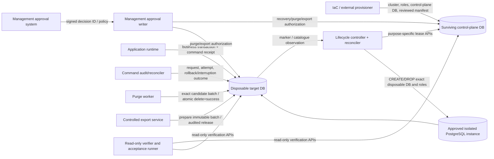
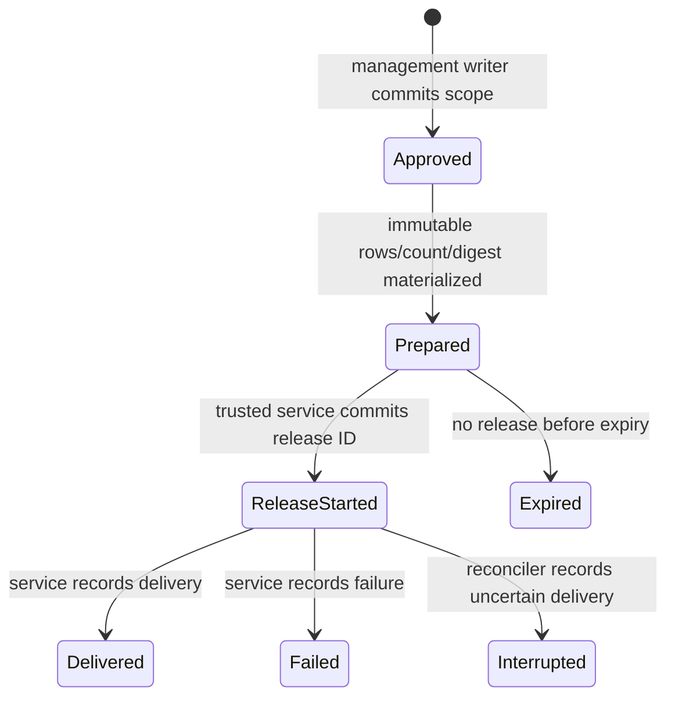

# REV869B one-day architecture freeze and root-cause review

Date: 2026-08-14 (Asia/Calcutta)

Starting commit: `ff7d038eac653d46999de98240d428fe973c8c54`

Review type: source-only architecture freeze; no Correction 19 implementation

## 1. Executive decision

Corrections 13 through 18 repeatedly improved local symptoms but retained six unresolved architectural themes: provisioning identity, lifecycle/recovery, purge durability, command-attempt lifecycle, ACL/export closure, and PostgreSQL acceptance-test validity. The findings survived because the design did not assign one authority to each fact, treated cross-database/nontransactional operations as if one PostgreSQL transaction could cover them, and used source-string/count assertions as substitutes for executable invariants.

One architecture is selected and frozen:

> **Externally provisioned cluster and roles + dedicated lifecycle controller + surviving control-plane database + target-local transactional command/purge/export ledgers.**

The source helper will not create or remove cluster roles/databases. An externally governed IaC/provisioning boundary creates the immutable cluster prerequisites and installs the reviewed control-plane package. A dedicated lifecycle controller is the only component allowed to create/drop disposable databases or roles. The control-plane database is authoritative for lease state and remains available after a target is dropped. Filesystem evidence is diagnostic only. Target-local command commit receipts and purge success evidence are committed atomically with the business/deletion transaction they describe; rollback/failure/interruption evidence is appended afterward by an independent audit/reconciler principal.

This report does not declare REV869B source safety or helper readiness. PostgreSQL execution remains prohibited.

### Correction 19 decision

**GO for one bounded, source-only Correction 19 implementation of the selected architecture and no other design.**

**NO-GO for PostgreSQL access, provisioning, migration application, purge, recovery, database tests, or operational use until Correction 19 is independently source-reviewed and separately authorized.**

Any proposal to retain a second active lifecycle/provisioning/attempt/purge/export architecture changes the decision to NO-GO and requires a new architecture review.

## 2. Authoritative review scope

The starting commit and target-scoped cleanliness matched exactly. The review reconciled:

- independent source-safety rereviews after Corrections 13, 14, 15, 16, 17 and 18;
- source correction checkpoints 13, 14, 15, 16, 17 and 18;
- current committed control-plane SQL and PowerShell package;
- current lifecycle/recovery registry and disposable-database helper;
- current command-context SQL, authorizer and protected purchase/configuration consumers;
- current purge coordinator and purge SQL;
- current role/ACL/export SQL and readiness predicates; and
- the 18 direct, 7 application and 25 corrected PostgreSQL test designs, source-only and unexecuted.

No file under `../legacy-reference/` was accessed. No PostgreSQL connection or database operation was attempted.

## 3. Recurring-finding matrix

| Theme | Correction 13 | Correction 14 | Correction 15 | Correction 16 | Correction 17 | Correction 18 review | Recurring invariant that remained unresolved |
|---|---|---|---|---|---|---|---|
| Instance identity and provisioning | C13-N01: filesystem-first pre-marker ownership | C14-N01: nominal control-plane readiness, incomplete transitions | C15-N01: names/counts, no reproducible package | C16-N01: descriptive package only | C17-N01: executable but arbitrary target, unsafe preflight/rollback, sampled verification | C17-N01 still FAIL: partial bootstrap cannot resume; source/ACL definitions not exact | One immutable cluster identity, externally authorized package identity, restart-safe ownership of partial provisioning, and complete catalogue/ACL verification |
| Lifecycle, quarantine and recovery | C13-N02: issuer/pre-state/outcome missing | C14-N02: consumed-without-outcome and partial lease proof | C15-N02: divergent timestamps/states and post-DROP ambiguity | C16-N02: filesystem-selected recovery and unreconcilable DropStarted | C17-N02: generic bypass, invalid graph, no finalization | C17-N02 still FAIL: self-asserted authority, invalid Quarantined outcome, non-idempotent finalization | Surviving authoritative state, purpose-specific transitions, stable attempt ID, factual post-state, and idempotent restart/reconcile after every interruption |
| Retention/purge authorization and durability | C13-N03/N04: no per-run approval, failure evidence or writer authority | C14-N03/N04: caller-supplied authority, rollbackable/incomplete evidence, weak role proof | C15-N03: caller transaction controls durability and eligibility diverges | C16-N03: autocommit convention, FK conflict, inconsistent states | C17-N03: valid begin unreachable; durability by convention | C17-N03 still FAIL: failure says retryable but state cannot retry | One management decision per execution, immutable candidate snapshot, atomic delete+success, independent failure/reconcile outcome, and explicit new-authorization retry semantics |
| Durable command authorization/attempt | C13-N05: durable command lifecycle absent | C14-N05: durable audit lacks terminal outcomes | C15-N04: missing instance/attempt identity | C16-N04: optional/bypassable attempt, constant sequence, no linkage | C17-N04: exact ID added but multi-attempt and post-commit linkage broken | C17-N04 still FAIL: process-global key, global uniqueness, grant-before-validation | Request-scoped idempotency, one command request with ordered attempts, mandatory attempt before mutation, business commit receipt in the business transaction, and restart reconciliation |
| Roles, ACL and controlled export | C13-N04/N05 plus prior least-privilege/privacy findings | C14-N04/N05: capability/ACL closure and terminal audit incomplete | C15-N05: persistent owner membership and no governed export | C16-N05: runtime directly exposed durable attempt table | C17-N05: sampled ACLs, stale grants, rollback-replayable export | C17-N05 still FAIL: incomplete effective ACL proof and indefinite live-query export replay | Exact allowlisted effective ACLs, externally governed owner/admin boundary, no direct runtime ledger access, immutable export batch and audited release semantics |
| Genuine PostgreSQL acceptance design | C13-N06: no new designs | C14-N06: 25 aliases to one body | C15-N06: scenario-looking code using wrong roles/unreachable paths | C16-N06: still missing state/fixtures/faults | C17-N06: bodies exist but many assert unrelated denial or contradict SQL | C17-N06 still FAIL: repeated bodies, impossible recovery baseline, nondrift drift test, incomplete evidence | One named invariant per isolated fixture; exact authorized setup; exact success/denial/failure path; before/after/durable evidence; interruption/restart/concurrency proof |

### Resolved or retained business invariants

The review does not reopen business behavior that the Correction 13–18 chain consistently retained:

- authorization must precede protected mutation;
- organization, actor, operation, aggregate, expected version and transition must be bound;
- protected business rows, histories and a committed command receipt must commit together;
- qualification segregation-of-duty, current-version and late-child guards remain required;
- temporary command metadata may be purged only after the approved retention boundary;
- durable security/business history is not a purge target; and
- no raw password, token, OIDC assertion or reusable secret belongs in durable evidence.

These are requirements, not justification for retaining every current table, role, function, sequence or filesystem artifact.

## 4. Root causes

### RC1 — no single owner for each fact

Database ownership was variously inferred from a file, target marker, source connection, control-plane row and environment variable. Recovery then had to reconcile competing truths. The frozen rule is: lifecycle truth lives only in the surviving control plane; target marker is corroborating evidence; filesystem evidence has no authority.

### RC2 — cross-boundary atomicity was claimed where PostgreSQL cannot provide it

`CREATE DATABASE`, `DROP DATABASE`, target-local transactions, control-plane transactions and network responses cannot share one atomic transaction. Successive corrections moved writes around these boundaries without adopting a saga/reconciler model. The frozen model records intent before an external action and uses an idempotent observation/finalization step afterward.

### RC3 — rollback-independent evidence was delegated to caller convention

Fresh/autocommit connections help honest clients, but a granted function remains callable inside a caller transaction. The design repeatedly described transactional inserts as durable without defining what happens after caller rollback, connection loss or uncertain commit. The frozen model makes destructive success evidence atomic with destruction and handles non-success through a separate audit/reconciler transaction.

### RC4 — “exact” meant names, totals or self-reported strings

Function counts, column counts, role names, literal authority strings and source-string assertions were treated as exact contracts. They do not establish definitions, effective privilege closure or authority. The frozen verifier compares canonical definitions and complete allowlists; authority is represented by the authenticated database principal and externally provisioned decision ID, never a caller-supplied label alone.

### RC5 — command request, attempt and receipt were conflated

A business idempotency key, a grant, an execution attempt and a terminal outcome are distinct concepts. Adding fields to one attempt row could not repair retry semantics. The frozen model uses one idempotent command request, one or more ordered attempts, and one immutable commit receipt.

### RC6 — administrative privilege was treated as ordinary ACL

PostgreSQL owners and sufficiently privileged administrators can bypass ordinary ACLs. Source cannot truthfully prove that an owner is incapable of changing owned objects. The frozen model treats cluster/provisioning ownership as an external trust boundary, removes those credentials from runtime components, and verifies all non-administrative effective ACLs exactly.

### RC7 — test labels and source contracts substituted for behavioral design

Discovery counts and substring assertions repeatedly passed while scenario bodies could not reach their named paths. The frozen acceptance rule requires a test to fail if its named operation is removed or bypassed and to assert authoritative pre-state, exact result/error, authoritative post-state and durable evidence.

### RC8 — correction scope grew by accretion

Each review introduced another role, table, field, state or wrapper around the current design. No correction removed superseded mechanisms. Complexity grew faster than assurance. Correction 19 must delete/retire competing mechanisms and may not introduce another parallel path.

## 5. Business requirements versus unnecessary complexity

| Business/security requirement | Necessary mechanism | Complexity that is not a requirement and is frozen out |
|---|---|---|
| Only an approved isolated cluster may be used | Externally pinned system identifier, TLS certificate fingerprint, endpoint/environment ID and manifest hash | Letting a helper accept any syntactically valid commit/host and then infer safety |
| Disposable DBs must be attributable and safely cleaned | Surviving lease registry, exact run-derived names, target marker, lifecycle controller, idempotent reconciliation | Filesystem intent as authority; direct test-process `CREATE/DROP DATABASE`; separate contradictory Dropped and Finalized consumer calls |
| Protected commands need exact actor/scope/version/operation binding | Request-scoped command envelope, database attempt, transaction-local command ID and existing mutation/history guards | Process-wide idempotency environment variable; one role/function/table per incidental stage; precomputing unrelated global uniqueness |
| A committed command must have durable evidence | Commit receipt inserted in the same business transaction | Post-commit best-effort linkage |
| A rolled-back/interrupted command must remain identifiable | Independently committed Started attempt plus audit-writer/reconciler terminal outcome | Trying to preserve Opened/Claimed rows that are intentionally inside a rolled-back business transaction |
| Temporary security metadata may be purged safely | Management decision, immutable candidate batch, atomic delete+success, independent failure/reconcile | Autonomous-transaction claims inside ordinary PostgreSQL functions; retry flags without a legal retry transition |
| Exceptional export must be controlled and auditable | Immutable prepared batch, field/row allowlist, expiry, release attempt audit and trusted export service | Claiming exactly-once delivery from a rollbackable SQL result set; querying a moving live ledger after approval |
| Runtime must be least privilege | Exact business allowlist and security-definer APIs; complete effective-ACL verifier | Broad `ALL TABLES` grants followed by sampled revokes; claims that owners are ACL-constrained |
| Tests must prove failures and recovery | Isolated fixture, deterministic failpoints, independent roles/connections, restartable controller | Test-name inventories, substring tests, arbitrary exceptions and owner-fabricated rows |

## 6. Architecture options

### Option A — selected: lifecycle controller + surviving control plane + target-local ledgers

Description: IaC externally provisions cluster identity, roles and the control-plane database. A dedicated lifecycle controller owns disposable database/role creation, DROP and reconciliation. The control plane stores lifecycle attempts and management decisions. Each target database stores command, purge and export ledgers whose success evidence is atomic with target data changes.

| Dimension | Assessment |
|---|---|
| Operational cost | Medium-high: one controller, one small control-plane DB, reconciler scheduling, externally managed credentials |
| Security | Strong separation: admin credentials never enter test/application processes; control plane survives target loss; target runtime has no lifecycle privilege |
| Failure recovery | Strong: explicit saga states and stable attempt IDs cover partial create, post-DROP and uncertain response windows |
| Testability | Strong: controller failpoints and control-plane read model make every interruption observable; target transactions remain independently testable |
| Portability | PostgreSQL-specific but infrastructure-provider neutral |

### Option B — rejected: target-local registry plus external IaC state only

Description: ownership marker, command audit and cleanup state live in the disposable target; IaC state or files identify targets after failure.

| Dimension | Assessment |
|---|---|
| Operational cost | Lower: no control-plane database/controller |
| Security | Weaker: test runner or IaC must retain database-admin capability; external state becomes an implicit authority |
| Failure recovery | Weak after target corruption/DROP because authoritative evidence disappears with the target; roles-only and database-without-marker states are ambiguous |
| Testability | Moderate before DROP, poor for post-DROP reconciliation and state-loss tests |
| Rejection reason | Cannot satisfy the required surviving authoritative post-DROP evidence without recreating a control plane elsewhere |

### Option C — rejected: all orchestration exposed as PostgreSQL SECURITY DEFINER functions

Description: continue the current direction with many database roles/functions, while application/test helpers sequence calls on fresh connections.

| Dimension | Assessment |
|---|---|
| Operational cost | Medium: fewer external services, but high SQL/role/function maintenance and credential distribution |
| Security | Appears narrow but trusts caller transaction behavior and retains broad owner/admin escape paths |
| Failure recovery | Weak across `CREATE/DROP DATABASE`, target loss and uncertain client commit; PostgreSQL has no general autonomous transaction for these functions |
| Testability | High unit/source-test surface but poor assurance; behavior depends on client transaction conventions |
| Rejection reason | This is the recurring Corrections 14–18 architecture and does not resolve the transaction/authority root causes |

### Selection rationale

Option A is the only option that provides a surviving authority after DROP, removes admin credentials from application/tests, makes cross-boundary failure explicit, and permits genuine interruption/restart testing. Its additional operational component is justified by requirements already imposed on the system. Options B and C are retired; Correction 19 must not preserve them as alternate execution paths.

## 7. Frozen component and interface diagram



### Frozen interfaces

Control-plane lifecycle API, purpose-specific only:

- `ReserveLease(exactCluster, exactTarget, runId, sourceManifest, targetManifest, ownershipNonceHash)`
- `BeginProvisioning(leaseId, expectedVersion)`
- `MarkReady(leaseId, expectedVersion, targetMarkerFingerprint, observedDatabaseIdentity)`
- `MarkInUse(leaseId, expectedVersion)`
- `AuthorizeNormalDrop(leaseId, expectedVersion)`
- `BeginDrop(leaseId, expectedVersion, attemptId)`
- `ConsumeRecoveryDecision(leaseId, expectedVersion, managementDecisionId, exactAuthorizedAction)`
- `RecordCleanupFailure(attemptId, observedTargetState, minimizedFailure)`
- `FinalizeAbsentTarget(attemptId, observedAbsenceFingerprint, rolesCleanupFingerprint)`
- `ReadLease(leaseId)` and `ReadNonterminalLeases(clusterId)`

There is no generic transition API and no caller-supplied issuer/authority string. The authenticated principal and externally written decision row establish authority.

Target command API:

- `RegisterCommandRequest(organization, operation, idempotencyKeyHash, requestHash, actorBinding)`
- `StartCommandAttempt(commandId, executionInstance, serviceInstance, ownershipLease, backendBinding)`
- `OpenCommandAttempt(attemptId)` inside the exact business transaction
- `CommitCommandAttempt(attemptId, committedBusinessFingerprint)` inside that same transaction
- `RecordNoncommitOutcome(attemptId, Rejected|RolledBack|Abandoned, minimizedCategory)` by audit writer
- `ReconcileCommandAttempt(attemptId)` returning authoritative request/attempt/receipt state

Target purge API:

- `RegisterPurgeAuthorization(managementDecisionId, scope, cutoff, limit, expiry, nonceHash)` by management writer
- `StartPurge(authorizationId)` commits exact candidate IDs/count/fingerprint or ZeroRows
- `ExecutePurge(purgeAttemptId)` atomically deletes the frozen candidates and appends Succeeded
- `RecordPurgeFailure(purgeAttemptId, minimizedFailure)` only after the deletion transaction has rolled back
- `ReconcilePurge(purgeAttemptId)`; retry always uses a new authorization linked to the failed attempt

Target export API:

- `PrepareExportBatch(managementDecisionId, organization, fields, maximumRows, asOf, expiry)` materializes immutable minimized rows and their digest
- `AuthorizeExportRelease(batchId, releaseId)` records a release attempt before bytes leave the trusted service
- `ReadPreparedExportBatch(batchId, releaseId)` reads only immutable prepared rows
- `RecordExportReleaseOutcome(releaseId, Delivered|Failed|Interrupted)`

Exactly-once network delivery is not claimed. One management approval produces one immutable batch; every release attempt is durable and replay-visible.

## 8. Frozen trust boundaries

| Boundary | Trusted for | Not trusted/allowed for |
|---|---|---|
| Management approval system/writer | Authoritative recovery, purge and export decision IDs; approver policy | Database creation, business mutation, direct ledger DML |
| External IaC/provisioner | Cluster identity, TLS, roles, credentials, control-plane DB, package manifest installation/rollback | Runtime commands or ad hoc support access |
| Lifecycle controller | Exact disposable role/database lifecycle and reconciliation | Business data access, purge/export, approval issuance |
| Surviving control plane | Lease state/version/events, lifecycle attempts/outcomes, management-decision consumption | Target business rows; filesystem assertions |
| Application runtime | Scoped business operations through exact command attempt | Lifecycle admin, direct security ledger DML, purge/export/recovery |
| Command audit/reconciler | Register request/attempt and noncommit/reconcile outcomes | Business mutation or management approvals |
| Purge worker | Execute one started, frozen purge batch | Approve purge, select new scope, export or mutate durable history |
| Export service | Prepare/release one approved minimized immutable batch | Live unrestricted ledger query, business DML, lifecycle admin |
| Verifier/test runner | Read-only exact verification and scenario assertions | Admin credentials, create/drop, direct evidence fabrication |
| PostgreSQL owner/cluster administrator | Emergency/external administration | Claimed source-enforced least privilege; its use is externally audited and never a normal application path |

## 9. Frozen role and ACL matrix

| Principal | LOGIN | Database/schema access | Exact allowed operations | Explicit denial/constraint |
|---|---:|---|---|---|
| `nexa_rev869b_control_plane_owner` | no | owns control-plane DB/schema objects | ownership only | no login, no elevated cluster capability |
| `nexa_rev869b_lifecycle_api` | yes | control-plane CONNECT/USAGE | reserve, read, normal lifecycle request functions | no table DML, no recovery decision consumption, no generic transition |
| `nexa_rev869b_lifecycle_audit` | yes | control-plane CONNECT/USAGE | record failure/finalize/reconcile outcomes | no create/drop privilege, no approval issuance, no direct tables |
| `nexa_rev869b_recovery_executor` | yes | control-plane CONNECT/USAGE | consume an existing management decision and start recovery | no decision creation, no direct state mutation |
| `nexa_rev869b_control_plane_verifier` | yes | control-plane CONNECT/USAGE | read-only exact verifier/read model | no mutation functions/tables |
| externally held lifecycle admin | yes, external only | cluster admin DB plus exact disposable targets | exact `CREATEDB`/`CREATEROLE`, role/database create/drop for derived names | no application/test process credential; no SUPERUSER/BYPASSRLS/REPLICATION; externally audited |
| `nexa_rev869b_security_owner` | no | target security objects | owns definer functions/ledgers | no login or elevated cluster capability |
| `nexa_rev869b_app_runtime` | yes | exact target CONNECT/USAGE and business allowlist | business DML plus open/commit command attempt APIs | no direct security/purge/export ledger DML/SELECT; no schema CREATE |
| `nexa_rev869b_command_audit` | yes | exact target CONNECT/USAGE | register request, start attempt, record noncommit/reconcile | no business DML, no direct ledger tables |
| `nexa_rev869b_management_writer` | yes, external service only | control-plane and target CONNECT/USAGE | insert purpose-specific recovery/purge/export decisions | no execution, business DML or direct ledger read |
| `nexa_rev869b_purge_worker` | yes | exact target CONNECT/USAGE | start/execute/reconcile exact purge attempts | no authorization creation, direct table DML, durable-history deletion or export |
| `nexa_rev869b_export_service` | yes | exact target CONNECT/USAGE | prepare/read immutable batch and record release outcome | no live unrestricted ledger query, business DML or purge |
| `nexa_rev869b_target_verifier` | yes | exact target CONNECT/USAGE | read-only exact verifier and minimized test read models | no mutation, export payload or owner privileges |

All LOGIN roles are `NOINHERIT`, capability-free unless the external lifecycle-admin row explicitly states otherwise, and have no unexpected membership. PUBLIC has no target/control-plane CONNECT, schema CREATE/USAGE, table/sequence privileges or function EXECUTE. Default privileges are closed. The exact verifier enumerates every package object, owner, membership and effective grantee; it does not sample.

## 10. Responsibility matrix

| Responsibility | Management | IaC/provisioner | Lifecycle controller | Control plane | App runtime | Audit/reconciler | Purge worker | Export service | Database constraints |
|---|---|---|---|---|---|---|---|---|---|
| Approve recovery/purge/export policy | A/R | I | I | records consumption | I | I | I | I | validates decision shape/state |
| Pin cluster/TLS/source manifest | A | R | verifies | stores binding | I | I | I | I | rejects mismatch |
| Create/drop disposable DB/roles | I | provisions controller capability | A/R | records intent/outcome | prohibited | observes/reconciles | prohibited | prohibited | exact names/markers |
| Command idempotency/request binding | I | I | I | I | R | A/R | I | I | unique request + fingerprint constraints |
| Business mutation and commit receipt | I | I | I | I | A/R | observes | I | I | same target transaction |
| Rollback/interruption terminalization | I | I | I | I | signals | A/R | I | I | idempotent terminal constraints |
| Purge candidate freeze and deletion | approves | I | I | I | prohibited | verifies evidence | A/R | I | frozen batch + atomic success |
| Controlled export | approves | I | I | I | prohibited | audits | I | A/R | immutable batch + release IDs |
| ACL verification | A policy | installs | verifies lifecycle roles | exact read model | self-check | exact target check | self-check | self-check | canonical catalogue predicate |
| Acceptance cleanup | I | I | A/R | authoritative state | I | verifies | I | I | target absence/role cleanup proof |

`A` = accountable, `R` = responsible, `I` = informed/prohibited from performing the action.

## 11. Frozen state machines

### 11.1 Disposable database lifecycle

```mermaid
stateDiagram-v2
    [*] --> Reserved: control-plane reservation committed
    Reserved --> Provisioning: controller accepts exact lease
    Provisioning --> Ready: target exists + exact marker + catalogue proof
    Ready --> InUse: verifier admits test/application use
    InUse --> DropAuthorized: normal cleanup requested
    DropAuthorized --> DropStarted: stable attempt committed
    DropStarted --> Finalized: target absent + exact roles cleaned; one control-plane transaction
    DropStarted --> CleanupFailed: target present/changed or operation failed
    Reserved --> Quarantined: ambiguity or mismatch
    Provisioning --> Quarantined: partial create/marker mismatch
    Ready --> Quarantined: ownership/catalogue mismatch
    InUse --> Quarantined: verification failure
    CleanupFailed --> RecoveryAuthorized: fresh management decision consumed
    Quarantined --> RecoveryAuthorized: fresh management decision consumed
    Reserved --> RecoveryAuthorized: approved abandoned reservation cleanup
    Provisioning --> RecoveryAuthorized: approved partial provisioning cleanup
    DropStarted --> RecoveryAuthorized: approved uncertain drop reconciliation
    RecoveryAuthorized --> DropStarted: exact same/new linked cleanup attempt
    RecoveryAuthorized --> Finalized: target proved absent and roles cleaned
    RecoveryAuthorized --> CleanupFailed: exact failure outcome
```

There is no externally visible `Dropped` state followed by a second fragile `Finalized` call. `FinalizeAbsentTarget` atomically records the absence/cleanup outcome and sets `Finalized`. Repeating it with the same attempt/evidence returns the same result; different evidence is rejected.

### 11.2 Command request and attempts

```mermaid
stateDiagram-v2
    [*] --> RequestRegistered: scoped idempotency + request fingerprint
    RequestRegistered --> AttemptStarted: database-generated ordinal
    AttemptStarted --> Committed: business rows + histories + receipt in one transaction
    AttemptStarted --> Rejected: no business commit
    AttemptStarted --> RolledBack: transaction rolled back
    AttemptStarted --> Abandoned: backend gone/lease expired; no receipt
    Rejected --> AttemptStarted: policy permits new linked attempt
    RolledBack --> AttemptStarted: caller retry with same command request
    Abandoned --> AttemptStarted: reconciled retry
    Committed --> [*]: replay returns authoritative receipt
```



Unique key: `(organization, operation, idempotency_key_hash)`. The stored request fingerprint must match on replay. A different request with the same key is rejected. Only one active attempt per command request is allowed; attempt ordinal is database-generated. The process environment is not an idempotency source.

### 11.3 Purge authorization and attempt

```mermaid
stateDiagram-v2
    [*] --> Approved: management writer commits decision
    Approved --> ZeroRows: start finds no eligible rows
    Approved --> Started: candidate IDs/count/digest frozen
    Started --> Succeeded: delete + terminal evidence commit atomically
    Started --> Failed: deletion rolled back; audit writer records minimized failure
    Started --> Interrupted: reconciler proves no committed success and no active transaction
    Failed --> [*]: retry requires new linked authorization
    Interrupted --> [*]: retry requires new linked authorization
    ZeroRows --> [*]
    Succeeded --> [*]
```



No authorization returns to Approved/Started. `RetryEligible` is removed; retry policy is represented by issuance of a new management decision that references the prior attempt.

### 11.4 Export batch and releases



Delivery may be retried only with a new release ID, and every release is visible. The batch never changes after Prepared.

## 12. Transaction and durability model

| Operation | Transaction boundary | Durable before external effect | Atomic success evidence | Failure/interruption handling |
|---|---|---|---|---|
| External cluster/control-plane provisioning | IaC state + reviewed package; outside application | approved cluster/manifest identity and IaC run | external installation record + exact read-only verification | IaC resumes/rolls back; application helper never repairs |
| Lease reservation | control-plane transaction T1 | Reserved lease/event | T1 | idempotent request ID handles acknowledgement loss |
| Create roles/database | lifecycle controller external step | T1 reservation and stable attempt | not cross-DB atomic; observed facts recorded next | restart reads control plane and catalogues; never trusts file |
| Target marker/install | target transaction T2 | lease/attempt already durable | target marker/schema transaction | mismatch -> Quarantined; controller can re-observe |
| Mark Ready/InUse | control-plane transaction T3 | exact marker/catalogue fingerprint | T3 | version CAS; duplicate same evidence idempotent |
| Command request + attempt | audit-writer target transaction C1 | request/attempt Started | C1 | validation precedes grant/open; duplicate key reconciles |
| Protected business command | target business transaction C2 | C1 attempt | business rows + histories + command receipt/outcome | rollback leaves no business/receipt; Started remains |
| Noncommit command outcome | audit-writer target transaction C3 after rollback | C1 attempt | C3 | reconciler waits for backend/attempt expiry and checks receipt |
| Normal drop begin | control-plane transaction L1 | stable DropStarted attempt | L1 | retry/reconcile always uses attempt ID |
| `DROP DATABASE` | lifecycle controller external step | L1 | PostgreSQL DROP itself | restart proves presence/absence; no target reopen if absent |
| Drop finalization | control-plane transaction L2 | L1 | absence + role-cleanup outcome + Finalized together | same evidence idempotent; changed evidence rejected |
| Recovery approval consumption | control-plane transaction R1 | externally written decision + exact lease | R1 | decision permanently consumed; attempt records failure/interrupt |
| Purge authorization/start | target transactions P1/P2 on trusted services | decision, then frozen candidates | ZeroRows or Started in P2 | acknowledgement loss reconciled by authorization/attempt ID |
| Purge delete | target transaction P3 | frozen candidate digest | deletion + Succeeded evidence in P3 | error rolls P3 back; separate P4 records Failed/Interrupted |
| Export prepare | target transaction E1 | approval | immutable batch rows/count/digest | no live-query drift after E1 |
| Export release | E2 commits release ID before bytes; E3 records outcome | release attempt | delivery cannot be database-atomic; outcome is honest | Failed/Interrupted retained; new release ID for retry |

## 13. Requirement classification

### Must be source-enforced

- Pass the existing request `IdempotencyKey` through every REV869B command; never read a process-global idempotency value.
- Validate complete command/lifecycle/purge/export inputs before any independent durable issuance.
- Use only purpose-specific controller/database interfaces; no generic transition or direct admin SQL in application/tests.
- Keep business mutation, business history/audit and committed command receipt in one owned transaction.
- Route rollback, interruption and uncertain-response cases to idempotent reconcilers.
- Treat filesystem artifacts as diagnostics only.
- Ensure each acceptance test constructs and reaches its named path with independent principals and deterministic failpoints.

### Must be database-enforced

- State/version compare-and-swap and legal transition graph.
- One immutable event per transition/attempt outcome and uniqueness/idempotency constraints.
- Command request key scope, request-fingerprint equality, database attempt ordinal and one active attempt.
- Mandatory exact attempt before protected mutation; receipt and business commit atomicity.
- Immutable purge candidate batch, delete/count equality and atomic deletion/success evidence.
- Immutable export batch and release IDs.
- Append-only durable evidence and retention-table separation.
- Complete non-administrative ACL/default/PUBLIC closure and purpose-specific EXECUTE grants.

### Must be externally provisioned

- PostgreSQL instance/system identifier, TLS certificate/SPKI fingerprint, endpoint and environment classification.
- Cluster/control-plane database, owner/admin roles, credentials and secret rotation.
- Reviewed source commit and aggregate package manifest allowlist.
- Lifecycle controller identity and its narrowly scoped CREATEDB/CREATEROLE capability.
- Management approval writer identity and authoritative recovery/purge/export decision records.
- Monitoring, backup, clock synchronization, reconciler scheduling and emergency-owner audit.
- Isolated disposable-test cluster capacity; no production/main/source/REV861 target.

### Requires management decision

- Name/owner of the lifecycle controller and on-call recovery authority.
- Accepted lifecycle recovery-time objective and maximum nonterminal lease age.
- Exact approver groups and separation of duties for recovery, purge and export.
- Confirmation of 90-day temporary metadata retention and at-least-ten-year durable evidence retention.
- Export field allowlist, maximum rows, batch expiry and acceptable at-least-once/audited delivery semantics.
- Whether failed/abandoned commands may retry automatically or require caller action by operation class.
- Emergency administrator access process, evidence retention and incident-review owner.
- Cost/availability owner for the dedicated control-plane DB and lifecycle controller.

The architecture defaults are: 15-minute management authorization lifetime, 90-day temporary retention, ten-year durable retention, no automatic recovery/drop, and no exactly-once export-delivery claim. Management must ratify or explicitly replace these values before operational authorization; Correction 19 may encode them as policy constants and fail closed.

## 14. External prerequisites

1. Management ratification of the selected architecture and decisions above.
2. An immutable isolated PostgreSQL instance identity including TLS verification, not only host text.
3. Externally provisioned capability-minimized roles and control-plane database.
4. A lifecycle controller/reconciler deployment boundary that does not expose admin credentials to application or test processes.
5. An authoritative management approval writer and decision schema.
6. Exact reviewed package manifest signing/allowlisting and complete read-only catalogue/ACL verification.
7. Deterministic controller/database failpoints available only in isolated acceptance environments.
8. Separately authorized PostgreSQL execution after Correction 19 source review; no execution is implied by this freeze.

## 15. Acceptance-test matrix for Correction 19

Every PostgreSQL test below is a future design only. Required common assertions: exact starting state, exact role/backend, exact action reached, exact result or SQLSTATE/constraint/object, exact business/catalogue post-state, exact durable evidence, no unrelated mutation, and exact cleanup/finalization.

| ID | Area and setup | Action/fault | Required acceptance evidence |
|---|---|---|---|
| P01 | Externally provisioned exact cluster/control plane | Run read-only verifier | Exact system/TLS/environment/manifest, object definitions and effective ACL allowlists match |
| P02 | Wrong system identifier, TLS fingerprint, endpoint, source commit or manifest | Request lifecycle operation | Denied before mutation; no lease/role/database change except minimized rejection event |
| P03 | Unexpected pre-existing role/database/object/grant | Verify | Exact mismatch reported; no repair or privilege widening |
| L01 | Fresh lease | Interrupt after reservation, before any role | Restart controller reads Reserved and either resumes exact attempt or requires approved cleanup |
| L02 | Fresh lease | Interrupt after each role, database create, marker transaction and Ready transition | Each phase maps to one authoritative state; no file authority; restart reaches Ready or Quarantined deterministically |
| L03 | Ready/InUse lease | Two concurrent normal cleanup requests | One DropStarted attempt wins; loser receives authoritative attempt; one DROP maximum |
| L04 | DropStarted | Interrupt before DROP, during connection loss, after DROP, after role cleanup and before final response | Same attempt reconciles presence/absence; absent target finalizes without target connection; one Finalized event |
| L05 | Target marker/catalogue mismatch | Verify/use/drop request | Use/drop denied; state Quarantined; no repair/drop without management decision |
| R01 | Quarantined/partial lease + valid management decision | Consume and recover | Decision consumed once; exact action; Finalized or CleanupFailed outcome |
| R02 | Wrong/expired/replayed decision or wrong target/pre-state/action | Consume | Exact denial; valid unused decision not destroyed by a wrong nonce from another request |
| R03 | Recovery action fails and process restarts | Reconcile | First failure/interrupt durable; decision non-reusable; new linked decision required for retry |
| C01 | New command request with caller idempotency key | Successful protected command | one request, one attempt, business/history/receipt committed together; authoritative response |
| C02 | Same key + same request after response loss | Replay | original committed receipt returned; no new business rows or active attempt |
| C03 | Same key + different request fingerprint | Replay | exact conflict; no mutation |
| C04 | Audit/receipt insertion fault inside business transaction | Commit | entire business/history transaction rolls back; Started attempt remains then terminalizes noncommit |
| C05 | Explicit rollback/savepoint rollback | Roll back | no business/receipt; nontransactional request/attempt remains; exact RolledBack outcome |
| C06 | Process interruption before open, after open, during command, after commit before response | Restart reconciler | receipt determines Committed; absent receipt after backend/TTL determines Abandoned/RolledBack; never double-commit |
| C07 | Two concurrent attempts for same command request | Barrier start | exactly one active/winner; loser observes authoritative state; database-generated ordinals unique |
| C08 | Pool/backend/transaction/actor/org/version/operation substitution | Open/mutate | exact denial at intended constraint/function; no business mutation |
| G01 | Missing/expired/wrong-scope purge authorization | Start | denial/rejection evidence; no candidate batch/deletion |
| G02 | Fresh authorization, zero eligible rows | Start | terminal ZeroRows, exact pre-count 0, no Succeeded label |
| G03 | Fresh authorization with eligible temporary rows and durable histories | Execute | frozen IDs/digest; exact rows deleted; durable security/business histories preserved; Succeeded atomic |
| G04 | Candidate drift after Started | Execute | deletion transaction rolls back; exact drift failure; candidates preserved |
| G05 | Deterministic delete/audit fault or caller outer rollback | Execute | no partial deletion; Started reconciles to Failed/Interrupted; failure evidence persists through separate writer |
| G06 | Concurrent/replayed start/execute | Barrier | one winner; authorization never returns to Approved; retry requires new linked authorization |
| E01 | Approved minimized export | Prepare | immutable batch/count/digest matches as-of snapshot and field/row allowlist |
| E02 | Insert new ledger row after batch preparation | Read batch | prepared output unchanged; audit count/digest still exact |
| E03 | Expired/wrong/replayed release ID | Read | exact denial or new audited release requirement; runtime cannot call export |
| E04 | Delivery failure/connection loss | Reconcile | release is Failed/Interrupted; retry has new release ID; no exactly-once claim |
| A01 | Each non-admin role | Enumerate database/schema/table/sequence/function/member/default/PUBLIC privileges | effective privileges equal exact matrix; any extra/missing grant fails verifier |
| A02 | Runtime/purge/export/recovery principals | Direct SELECT/INSERT/UPDATE/DELETE/TRUNCATE and ungranted function calls | exact denials across every protected object category |
| T01 | Acceptance fixture | Test process requests database | process never receives lifecycle-admin credentials; controller owns create/drop |
| T02 | Any scenario failure | Dispose/restart cleanup | controller records Quarantined/CleanupFailed or Finalized; no silent swallow; no orphan target/role |
| T03 | Scenario name/body mutation check | Remove intended action from body | test must fail, proving it cannot pass on label or unrelated denial |

## 16. Exact bounded Correction 19 implementation specification

Correction 19 is one source-only correction against this frozen architecture. It may change only the following paths; any additional path requires explicit scope approval before editing.

### Production/application allowlist

1. `src/SESS.NexaERP.Application/Purchase/Rev869BPurchaseContracts.cs`
   - Preserve existing request `IdempotencyKey` fields; add only the minimal command-envelope abstraction if needed.
2. `src/SESS.NexaERP.Api/Endpoints/Rev869BPurchaseEndpoints.cs`
   - Pass request-scoped idempotency and correlation; no environment fallback.
3. `src/SESS.NexaERP.Api/Endpoints/Rev869AConfigurationEndpoints.cs`
   - Require/pass an explicit idempotency value for protected qualification operations and use the same transaction/outcome contract.
4. `src/SESS.NexaERP.Infrastructure/Persistence/Rev869BCommandContextAuthorizer.cs`
   - Replace grant-first/process-environment flow with request registration, ordered attempt start, exact open, commit receipt and noncommit/reconcile APIs.
5. `src/SESS.NexaERP.Infrastructure/Persistence/Migrations/Rev869BCommandContextSql.cs`
   - Replace the current command attempt, purge and export lifecycle with the frozen tables/functions/state constraints; retire superseded functions and global idempotency uniqueness.
6. `src/SESS.NexaERP.Infrastructure/Purchase/EfRev869BPurchaseService.cs`
7. `src/SESS.NexaERP.Infrastructure/Purchase/EfRev869BPurchaseService.RfqQuotation.cs`
8. `src/SESS.NexaERP.Infrastructure/Purchase/EfRev869BPurchaseService.ComparisonPo.cs`
9. `src/SESS.NexaERP.Infrastructure/Purchase/EfRev869BPurchaseService.MaterialFollowUp.cs`
   - Thread the existing request idempotency key to one command request; stage the committed receipt exactly once; terminalize rollback/interruption without post-commit best effort.

No new EF migration ID, migration class, designer or model snapshot is permitted. Only the existing REV869B raw SQL fragment may change because REV869B remains unapplied and under pre-apply review. No business schema/domain expansion is permitted.

### Control-plane/provisioning allowlist

10. `tools/manage-rev869b-control-plane-secure.ps1`
    - Remove cluster-mutating execution modes; retain plan/read-only verification only.
11. `tools/rev869b-control-plane-preflight.sql`
    - Read-only exact externally provisioned cluster/manifest/role/database check.
12. `tools/rev869b-control-plane-install.sql`
    - Transactional control-plane schema package for an already externally provisioned database; purpose-specific APIs only; no generic transition grant.
13. `tools/rev869b-control-plane-verify.sql`
    - Canonical definitions and complete effective ACL allowlists, not counts/samples.
14. `tools/rev869b-control-plane-rollback.sql`
    - Transactional schema rollback only after exact finalized-state gate.
15. `tools/rev869b-control-plane-bootstrap.sql`
16. `tools/rev869b-control-plane-deprovision.sql`
    - Delete/retire these cluster-mutating helper artifacts; external IaC owns database/role provisioning and deprovisioning. They may not remain callable alternate paths.

The external IaC/controller implementation is an external prerequisite, not a hidden second implementation inside tests or PowerShell.

### Test/harness allowlist

17. `tests/SESS.NexaERP.Tests/Rev869BControlPlaneProvisioningContract.cs`
18. `tests/SESS.NexaERP.Tests/Rev869BControlPlaneRegistry.cs`
    - Model the selected interfaces/state/version/idempotent finalizer and exact verifier.
19. `tests/SESS.NexaERP.Tests/Rev869BTestDatabaseLease.cs`
    - Remove direct admin create/drop and filesystem authority; consume a lifecycle-controller client only.
20. `tests/SESS.NexaERP.Tests/Rev869BOwnedPostgresDatabase.cs`
    - Use request/attempt/receipt APIs; no direct grant bypass and no environment idempotency key.
21. `tests/SESS.NexaERP.Tests/Rev869BPurgeCoordinator.cs`
    - Implement frozen start/execute/failure/reconcile client contract and new-authorization retry.
22. `tests/SESS.NexaERP.Tests/Rev869BCorrection17PostgresScenarios.cs`
23. `tests/SESS.NexaERP.Tests/Rev869BCorrection14PostgresDesignTests.cs`
    - Replace all 25 bodies with the acceptance matrix; one invariant per fact; deterministic failpoints.
24. `tests/SESS.NexaERP.Tests/Rev869BCorrection16SourceContractTests.cs`
25. `tests/SESS.NexaERP.Tests/Rev869BCorrection17SourceContractTests.cs`
26. `tests/SESS.NexaERP.Tests/Rev869BDatabaseSafetyContractTests.cs`
27. `tests/SESS.NexaERP.Tests/Rev869BPurchaseCorrectionTests.cs`
    - Replace substring/count claims with parsed signatures/state/ACL inventories and source-order invariants. Do not claim PostgreSQL behavior.
28. `tests/SESS.NexaERP.Tests/Rev869BPostgresBehaviorTests.cs`
29. `tests/SESS.NexaERP.Tests/Rev869BPostgresApplicationBehaviorTests.cs`
    - Bind retained direct/application tests to the new command and lifecycle interfaces without weakening business assertions.

One new test-only controller client file is permitted if necessary:

30. `tests/SESS.NexaERP.Tests/Rev869BLifecycleControllerClient.cs`
    - Typed client only; no embedded administrator credential or direct create/drop SQL.

### Documentation allowlist

31. `outputs/rev869b_source_correction_checkpoint_19.md`
    - Exact changed paths, frozen-interface mapping, source-only validation and explicit nonclaims.

### Required removals and non-goals

- Remove `REV869B_COMMAND_IDEMPOTENCY_KEY` from production/test command paths.
- Remove any caller grant to generic lifecycle transition functions.
- Remove mutable live-query export after authorization.
- Remove retry flags that lack a legal state transition.
- Remove direct lifecycle-admin connections and filesystem-authority decisions from test helpers.
- Do not add another role/function/table unless it maps to a frozen responsibility and replaces a superseded mechanism.
- Do not change business scope, earlier migrations, migration identity, EF model/designer/snapshot, unrelated APIs, UI, production configuration or external infrastructure.
- Do not run PostgreSQL or database tests during Correction 19 source implementation unless separately authorized after source review.

### Correction 19 source completion gate

Correction 19 is complete only when:

1. every allowed change maps to a frozen interface/invariant;
2. competing current paths are deleted or made unreachable;
3. build, non-PostgreSQL tests, PowerShell AST, EF no-connect discovery, model/snapshot parity, SQL generation/hash and Git checks pass offline;
4. all future PostgreSQL tests compile/list but are explicitly NOT RUN;
5. an independent source-only rereview verifies the implementation against this report; and
6. no source-safety/helper-readiness PASS is self-declared by the correction checkpoint.

## 17. Final freeze and GO/NO-GO

The architecture is frozen on Option A. Options B and C are rejected and must not remain active alternatives.

**Correction 19 source-only implementation: GO, limited to the exact specification and file allowlist above.**

**Any design deviation, new execution path, additional file, PostgreSQL access or operational action: NO-GO pending explicit review/authorization.**

**PostgreSQL provisioning, migration, purge, recovery, export and acceptance execution: NO-GO.**

This architecture decision is not a source-safety or helper-readiness PASS and does not authorize deployment or database activity.
