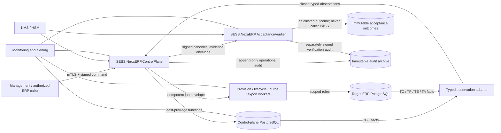
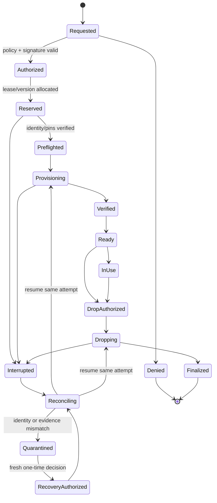

# REV869B external controller architecture-freeze review

## Executive decision

**Architecture review: PASS. Selected option: A. External-controller source gate: GO for the phased controller implementation defined here. Correction 29 remains NO_GO.**

Create dedicated SESS-owned `SESS.NexaERP.ControlPlane` and `SESS.NexaERP.AcceptanceVerifier` production projects in this SESS-controlled repository. Build and release them as independently versioned artifacts and deploy them separately from `SESS.NexaERP.Api`, the control-plane database, and every target ERP database. The Control Plane is the sole command/lifecycle authority. The Acceptance Verifier is a separately deployed, separately keyed consumer that alone calculates acceptance outcomes.

Option A is preferred because the repository already owns the ERP application contracts, REV869B database readers, migrations and source tests. Co-location permits atomic contract review, reproducible builds, full source availability and traceable compatibility without collapsing deployment or runtime trust boundaries.

Option B can be acceptable only if SESS organizational policy requires a separate repository and full source, history, build, security, deployment and operations handover are completed before implementation. It adds cross-repository version skew and release-coordination risk without improving runtime isolation beyond the separate deployments already required by Option A.

Option C—continuing with test/reference adapters—is prohibited. Test fixtures, the xUnit client, local adapter and local OR3 dispatcher have no production identity or deployment and cannot prove production behavior.

This review changes the frozen design only as a management-pending architecture proposal. It does not authorize controller code, Correction 29, PostgreSQL work or deployment.

## Entry gate

| Check | Evidence | Result |
|---|---|---|
| Authorized HEAD | `f37216b5b9a5431b8519e1cae90b4e387b7f812b` | PASS |
| Expected parent | `5e23b8443768e71c5ce9308177bd901c9f591314` | PASS |
| Feasibility commit | exactly one report | PASS |
| Feasibility report SHA-256 | `7A0A9D05FAC1716597BD7BC6AB9313232573D30A45EE70E4BDC77C3DC0EFB701` | PASS |
| Target-scoped worktree | clean | PASS |
| Correction 29 | `NO_GO` | PASS |
| External adapter prerequisite | `BLOCKING` | PASS |
| Architecture review required | `YES` | PASS |
| F23-01 | `PASS_RETAINED` | PASS |
| Enterprise scale | `PASS` | PASS |

## Project, artifact and ownership freeze

| Responsibility/artifact | Accountable production owner | Runtime/deployment owner | Boundary |
|---|---|---|---|
| `SESS.NexaERP.ControlPlane` source and executable | named SESS Control Plane engineering owner, to be assigned before source work | SESS Platform/SRE | separate service, workload identity and release |
| `SESS.NexaERP.AcceptanceVerifier` source and executable | named SESS Assurance engineering owner, separate approver from Control Plane | SESS Platform/SRE with independent deployment approval | separate service, key and scaling unit |
| Shared versioned message contracts | SESS architecture owner; changes require Control Plane, ERP, DBA and Assurance approval | artifact registry owner | signed package consumed by controller/verifier/tests |
| Control-plane PostgreSQL database | SESS DBA owner | managed database operations | survives loss/quarantine/replacement of target databases |
| Target ERP databases | ERP data owner per company | DBA operations | never host controller authority or signing keys |
| Signing/key policy | SESS Security owner | KMS/HSM operations | distinct controller and verifier/audit keys |
| Provisioning/migration workers | Control Plane owner | privileged worker deployment owner | isolated workers; controller API never holds owner credentials |
| ERP business runtime | existing SESS ERP product owner | ERP application operations | issues approved business requests; not lifecycle authority |
| Monitoring/on-call | Control Plane SRE owner | 24x7 operations | alerts on command backlog, key, DB, replication and evidence failures |

The production controller version starts at `REV869B-CONTROLLER-v1`; the verifier at `REV869B-VERIFIER-v1`; contracts at `REV869B-CONTROLLER-CONTRACTS-v1`. Every artifact must also carry a source commit, reproducible artifact digest and SBOM. A semantic version label without those hashes is insufficient.

## Component diagram

The Control Plane, verifier and control database remain available when a target database is failed, quarantined, dropped or replaced. No control authority is derived from target availability.

## Mandatory controller responsibility matrix

| Responsibility | Production owner/component | Durable authority |
|---|---|---|
| Signed lifecycle command issuance | Control Plane command API | signed command envelope + control command record |
| Authorization identity/key management | Security/KMS plus Control Plane authorization module | key ID, policy version, principal and authorization decision |
| Control-plane registry | Control Plane store | instance/cluster/lease registry |
| Database/cluster identity | identity verifier worker | cluster system ID, server certificate/SPKI, instance digest |
| Lease/version enforcement | lifecycle orchestrator | lease row plus immutable lease events |
| Command-attempt sequencing | command orchestrator | command, attempt, transaction and terminal outcome ledgers |
| Idempotency/replay protection | API inbox + unique command/idempotency indexes | request digest and prior response/outcome |
| Provisioning lifecycle | isolated provisioning worker | lifecycle attempt/event chain |
| Preflight/verification | preflight worker + verifier facts | manifest, source, endpoint, TLS and catalog fingerprints |
| Migration authorization | management-authorized plan + migration worker | exact source/manifest/migration/target authorization |
| Quarantine/recovery | lifecycle orchestrator + recovery executor | quarantine outcome and one-time recovery decision |
| Drop authorization | management authorization module | exact target/lease/version/registration binding |
| Purge authorization/execution | authorization module + purge worker/auditor | root/retry/batch/attempt/candidate/event chain |
| Durable audit | independent append-only audit writer | immutable event ID/hash chain and archive object |
| Evidence assembly | production typed observation adapter in Control Plane | closed observations and canonical envelope |
| Export authorization | management authorization + export worker | authorization/batch/release chain |
| Retry/terminal reconciliation | reconciler workers | same-attempt resume or fresh explicit authorization |
| Failure/interruption recovery | durable queue/outbox + reconcilers | leases, heartbeats, attempt state and recovery decisions |
| Multi-company scope | authorization and execution binding | mandatory company ID or explicit control-plane N/A |
| Health/alerting | SRE monitoring | metrics, structured logs, traces and alert incidents |

## Trust-boundary matrix

| Boundary | Authentication | Authorization | Data allowed across | Prohibited |
|---|---|---|---|---|
| Caller → Control Plane | mTLS workload identity plus signed request/JWT audience | management policy, company scope, operation allowlist | command intent and idempotency key | caller PASS, actual result, verifier code |
| Control Plane → control DB | short-lived workload credential | lifecycle API/management writer roles only | commands, leases, events, decisions, envelopes | owner/superuser, target business writes |
| Control Plane → worker | signed job envelope, queue identity | exact operation/target/lease/version | bounded action parameters | generic SQL or arbitrary database target |
| Worker → target DB | short-lived per-worker credential | exact existing target role/functions | scoped mutation and facts | security owner, cross-company/unbounded access |
| DB readers → adapter | verifier DB role, TLS, function execute only | exact fact reader signatures | closed raw fact schema | caller expectations/PASS/oracle values |
| Control Plane → verifier | mTLS plus controller envelope signature | verifier accepts compatible schema/oracle only | canonical evidence + action result | controller verdict/PASS |
| Verifier → outcome/audit | verifier signing identity | append only | calculated PASS/FAIL and failure components | update/delete of prior outcome |
| Operators → services | SSO/MFA, break-glass vault | audited RBAC and dual control | approved operations | shared credentials/direct table mutation |

## API and message contract inventory

Every message includes `contractVersion`, `messageId`, `idempotencyKey`, `issuedAtUtc`, `expiresAtUtc`, caller/service identity, `companyId` or explicit control-plane N/A, instance hash, lease ID/version, execution ID, scenario/subcase when applicable, operation ID, preparation ID, attempt ID, oracle version/hash when verifying, payload SHA-256, signing key ID and signature. Responses return observed results only.

| Contract | Purpose | Required result |
|---|---|---|
| `POST /v1/rev869b/commands` | submit management-authorized lifecycle/purge/export/recovery command | command ID, authorization ID, accepted/rejected code |
| `GET /v1/rev869b/commands/{id}` | idempotent status/readback | current attempt and terminal outcome links |
| `POST /v1/rev869b/test-leases` | allocate isolated acceptance target | signed lease/instance/fixture input binding |
| `POST /v1/rev869b/acceptance/prepare` | register one exact subcase execution | signed execution binding; no expected actual values |
| `POST /v1/rev869b/acceptance/{scenario}/actions` | dispatch registered live action | signed actual action receipt |
| `POST /v1/rev869b/test-leases/{lease}/release` | request idempotent cleanup | signed cleanup request/result IDs |
| `GET /v1/rev869b/audit/{run}/{read}` | independently read audit observation | separately signed audit evidence |
| `POST /internal/v1/observations` | submit closed typed observation batch | observation IDs/watermarks and digest |
| `POST /internal/v1/evidence/envelopes` | seal canonical evidence | envelope ID/hash/signature, never verdict |
| `POST /internal/v1/verify` | independent verification | calculated outcome, failures and verifier signature |
| `GET /health/live`, `GET /health/ready` | process/dependency health | no secrets or business data |

Unknown fields, missing fields, duplicates, incompatible versions, expired messages, digest/signature mismatch and replayed IDs fail closed. Idempotent replay with the identical digest returns the original result; the same key with a different digest is rejected.

## Evidence-pipeline ownership

| Stage | Owner | Contract/output | Binding and rejection |
|---|---|---|---|
| Database fact readers | control/target database security owners | `REV869B-FACTS-vNext` closed facts | exact company/instance/lease/version/operation/execution/subcase/stage; DB-calculated cardinality/digest |
| Closed typed observations | Control Plane production adapter | `REV869B-OBSERVATION-v1` | real transaction snapshot/event/LSN watermark; missing/null/duplicate rejected |
| Trusted adaptation | Control Plane adapter module | normalized selectors/references with provenance | no oracle operators/expected values used to derive actual facts |
| Canonical evidence envelope | Control Plane evidence sealer | `REV869B-EVIDENCE-vNext` signed envelope | preparation/action/before/after/durable/cleanup identities and hashes |
| Independent verification | Acceptance Verifier | `REV869B-VERDICT-v1` | independently loaded oracle; exact action fields and 133 terms evaluated |
| Durable outcome | verifier outcome store + immutable archive | signed PASS/FAIL record | append-only, retention/legal hold, controller cannot rewrite |

Before is captured after preparation and before action with a database transaction/event watermark. Action has its own dispatch and transaction/event IDs. After uses a new transaction after the action terminal receipt. Durable history is read from immutable ledgers after commit/restart visibility. Cleanup is separately requested and observed. Absence is an explicit zero-row result tied to a watermark; rollback requires unchanged before/after hashes plus an exact rollback terminal event. One observation or scenario snapshot cannot satisfy multiple subcases.

## PostgreSQL role and ACL matrix

| Role | Service identity | Allowed | Explicitly denied |
|---|---|---|---|
| `nexa_rev869b_control_plane_owner` | NOLOGIN ownership role | own control schema/functions | runtime login |
| `nexa_rev869b_lifecycle_api` | Control Plane API | approved lifecycle functions/readback | direct relation writes, target DB |
| `nexa_rev869b_management_writer` (control) | authorization module | register approved decisions/authorizations | lifecycle execution, owner rights |
| `nexa_rev869b_recovery_executor` | recovery worker | consume exact decision and approved recovery functions | create decisions/general writes |
| `nexa_rev869b_lifecycle_audit` | independent audit worker | append/read audit functions | lifecycle mutation |
| `nexa_rev869b_control_plane_verifier` | observation adapter | approved CP fact readers only | direct tables/mutation |
| `nexa_rev869b_security_owner` | NOLOGIN target owner | target ownership | runtime login |
| `nexa_rev869b_lifecycle_administrator` | isolated privileged worker | exact owner-maintenance workflow | application/business runtime |
| `nexa_rev869b_app_runtime` | ERP application | existing bounded business DML | security/lifecycle/purge/export functions |
| `nexa_rev869b_command_audit` | command audit worker | command audit/reconciliation functions | business DML |
| `nexa_rev869b_purge_worker` | purge executor | exact authorized purge functions | authorization creation/general DML |
| `nexa_rev869b_purge_audit` | purge auditor | failure/reconciliation audit | purge execution |
| `nexa_rev869b_export_service` | export worker | exact prepared batch/release reads | arbitrary table export |
| `nexa_rev869b_target_verifier` | observation adapter | TC/TP/TE/TA fact readers | direct relations/mutation |
| `PUBLIC` | none | none on REV869B schema/functions | all application/controller privileges |

Roles are NOINHERIT unless an existing frozen role contract explicitly states otherwise. Runtime credentials are short-lived, separately issued per workload and never owner/superuser. ACL fingerprint verification is mandatory at startup and before privileged jobs.

## Signing-key lifecycle

1. Security creates distinct non-exportable KMS/HSM keys for controller envelopes and verifier/audit outcomes; root administration requires dual control.
2. Each signature includes algorithm, key ID, key version, purpose, artifact/service identity and issued time. Only approved asymmetric algorithms and canonicalization versions are accepted.
3. Public keys are distributed through a signed trust bundle pinned by deployment; private keys never enter PostgreSQL, source, images, logs or ordinary secret variables.
4. Rotation creates a new key, publishes it, verifies readiness, activates signing, retains the prior public key for the maximum message/audit verification lifetime, then revokes signing use. Emergency revocation immediately blocks new messages and alerts.
5. Historical audit verification retains public keys and revocation metadata for at least the ten-year evidence retention period. Controller and verifier keys may never be identical.

## Control-plane storage model

Retain the existing independent lease, lifecycle event, attempt, outcome, recovery decision, quarantine and manifest ledgers. A later separately authorized migration may add: command inbox/idempotency records; execution bindings; controller instance attestations; observation headers/fact provenance; evidence envelope metadata; verifier outcomes; outbox/dead-letter records; signing-key metadata; health incidents. Every mutable workflow has an append-only event chain and exactly one terminal outcome per attempt.

Primary keys are UUIDs; company/time and exact identity indexes support bounded reads. Large append-only tables are time-partitioned with company/execution indexes. Payloads are minimized; large signed evidence is content-addressed in encrypted immutable object storage with database hash/URI metadata. No distributed transaction spans control and target databases: durable inbox/outbox, idempotent workers and reconciliation provide recovery.

## Failure and recovery state machine

Leases use compare-and-swap versions. One active attempt exists per operation boundary. Heartbeat expiry marks interruption, never success. Recovery resumes the same durable attempt unless a fresh signed recovery/drop/purge authorization explicitly permits a new attempt. Target loss does not delete control records. Identity mismatch quarantines and blocks use/drop until an authorized recovery decision. Terminal reconciliation is idempotent.

## Deployment topology and network boundaries

- At least three Control Plane instances across failure domains behind a private load balancer; stateless request handling with durable DB/queue state.
- At least two independently deployed Acceptance Verifier instances with a separate workload identity, signing key and release approval.
- Dedicated HA control-plane PostgreSQL primary/standby, not hosted inside any target ERP database or target lifecycle.
- Isolated worker pools for provisioning/migration, lifecycle/recovery, purge and export. Privileged roles exist only in their respective pools.
- Private network segments and deny-by-default security groups: callers→API, API/workers→control DB, exact workers/verifier→authorized target DBs, services→KMS/queue/telemetry. No public PostgreSQL.
- Separate development, staging and production accounts/projects, keys, databases, queues and artifact promotion. Production cannot trust development keys.
- Horizontal application scaling uses idempotency, leases and queue partitioning; no in-memory singleton is authoritative.

## Backup, PITR and disaster recovery

- Control DB: encrypted continuous WAL/PITR plus daily full backups, cross-failure-domain replica and cross-region copy. Proposed minimum management targets are RPO ≤5 minutes and RTO ≤60 minutes, validated by scheduled restore drills.
- Immutable audit/evidence: versioned, encrypted, WORM-capable object storage replicated cross-region; ten-year retention with legal-hold support and periodic hash-chain verification.
- KMS: multi-region/disaster-recovery key policy where supported; separately backed-up public trust bundles and documented emergency rotation.
- Queue/outbox: replayable from durable control records; recovery never depends solely on transient queue state.
- Target databases: separate per-target backup/PITR policy; controller registry records backup/recovery identity and refuses an unverified restored target.
- DR promotion requires dual approval, DNS/service discovery change, control DB fencing, controller instance attestation, key-access verification and reconciliation of every nonterminal attempt before normal commands resume.

## Configuration, secrets, logging and monitoring

Configuration is schema-validated and versioned; environment-specific values come from a managed configuration service. Secrets are references to a secret manager/KMS, never committed or logged. Startup fails on unknown production mode, missing pins, ACL/catalog mismatch, incompatible contract/schema/oracle versions or unavailable durable stores.

Structured logs include correlation/execution IDs but exclude credentials, connection strings, raw personal data and unrestricted payloads. Immutable audit is distinct from operational logs. Metrics cover request/replay rejection, lease conflicts, nonterminal age, worker retries, queue lag, observation latency, verification failures, ACL drift, key expiry/rotation, DB replication/PITR health and audit archival. Alerts have runbooks and named on-call ownership.

## Enterprise scale and performance freeze

The design supports 3 lakh+ customers, 3 lakh+ vendors, 3 lakh+ registered users, 1 crore+ items, 1 lakh+ machines, 1 lakh+ projects, at least two companies, shared masters, separate company financial/stock ledgers, ten-year history and horizontally scaled applications by enforcing:

- company ID in every company-applicable authorization, command, index, reader and evidence binding;
- no cross-company financial/stock operation or evidence aggregation;
- shared-master references by stable IDs, while transactional ledgers remain company-partitioned;
- exact-key/ordered-range readers only, with authorization maximums, pagination and statement timeouts;
- no full master/ledger load into controller memory; streaming/content-addressed evidence with bounded batches;
- time partitioning for control events/audit, company/time indexes, archival tiers and online partition maintenance;
- stateless APIs, idempotent workers, queue partitioning by company/instance, bounded connection pools and backpressure;
- load tests at declared cardinalities, query-plan regression checks, partition-pruning tests and ten-year retention simulations before production GO.

The existing enterprise-scale compatibility assessment remains PASS; implementation must preserve it.

## Version compatibility, upgrade and rollback

Controller, verifier, contracts, DB schema, reader schema, evidence schema and oracle each advertise independent versions. A compatibility manifest declares allowed combinations and is signed with the release. Deploy expand/contract changes: add backward-compatible readers/contracts, deploy consumers, switch producers, verify, then retire old versions after retention/replay windows. Blue/green or canary controller releases drain nonterminal attempts before cutover. Rollback never rolls back durable events; it deploys a compatible prior binary against the still-supported expanded schema. Irreversible DB changes require backup/restore rehearsal and separate management authorization.

## Source and full-handover requirements

Before implementation or vendor contribution, SESS must possess complete source/history, build definitions, dependency locks, generated-code inputs, schemas/migrations, IaC, deployment manifests, KMS policies, runbooks, threat model, data-flow/privacy review, SBOM, vulnerability results, unit/contract/integration/failure/DR/load tests, test data provenance, monitoring dashboards/alerts and reproducible artifact-signing instructions. No binary-only adapter, inaccessible repository, undisclosed generated source, vendor-held key or undocumented production step is acceptable.

## Exact implementation phases and gates

1. **Management approval and accountable ownership:** approve Option A; name Engineering, Assurance, Security, DBA and SRE owners. No code before approval.
2. **Contract/trust skeleton:** create shared contracts, Control Plane and Verifier projects with closed message schemas, compatibility manifest, signature interfaces, state-machine types and architecture tests. No PostgreSQL or lifecycle mutation capability.
3. **Control persistence:** separately authorize schema/migration for inbox, execution binding, outbox, observation and outcome metadata; prove PITR/restore and ACLs offline then isolated.
4. **Lifecycle command plane:** implement signed authorization, leases, idempotency, preflight, provision/migration/quarantine/recovery/drop workers and reconciliation using existing frozen SQL functions.
5. **Evidence pipeline:** implement real temporal watermarks, typed adapter, canonical envelope and independent verifier; consume every action-result field and all 133 terms.
6. **Purge/export and OR3:** implement exact authorization/worker flows and a registered live OR3 handler through the complete pipeline.
7. **Security/DR/scale qualification:** threat model, key rotation, ACL negatives, chaos/interruption, restore, multi-company isolation and declared-scale tests.
8. **Fresh independent review:** review deployed artifacts, all 108 live subcases and zero synthetic PASS paths. Only then may management reconsider Correction 29 or execution readiness.

## Smallest bounded allowlist for Phase 2, first controller source implementation

The first authorized implementation must be contract/trust skeleton only and may create exactly these new files; it may not edit existing ERP source, SQL, migrations, helpers or Correction 28 tests:

1. `src/SESS.NexaERP.ControlPlane.Contracts/SESS.NexaERP.ControlPlane.Contracts.csproj`
2. `src/SESS.NexaERP.ControlPlane.Contracts/Rev869BControllerMessagesV1.cs`
3. `src/SESS.NexaERP.ControlPlane.Contracts/Rev869BCompatibilityManifestV1.cs`
4. `src/SESS.NexaERP.ControlPlane/SESS.NexaERP.ControlPlane.csproj`
5. `src/SESS.NexaERP.ControlPlane/Program.cs`
6. `src/SESS.NexaERP.ControlPlane/Configuration/ControlPlaneOptions.cs`
7. `src/SESS.NexaERP.ControlPlane/Domain/Rev869BExecutionBinding.cs`
8. `src/SESS.NexaERP.ControlPlane/Domain/Rev869BControllerStateMachine.cs`
9. `src/SESS.NexaERP.ControlPlane/Security/SignedEnvelopeService.cs`
10. `src/SESS.NexaERP.ControlPlane/Endpoints/ControllerContractEndpointsV1.cs`
11. `src/SESS.NexaERP.AcceptanceVerifier/SESS.NexaERP.AcceptanceVerifier.csproj`
12. `src/SESS.NexaERP.AcceptanceVerifier/Program.cs`
13. `src/SESS.NexaERP.AcceptanceVerifier/Verification/ClosedEvidenceVerifierV1.cs`
14. `tests/SESS.NexaERP.ControlPlane.Tests/SESS.NexaERP.ControlPlane.Tests.csproj`
15. `tests/SESS.NexaERP.ControlPlane.Tests/ArchitectureFreezeContractTests.cs`
16. `outputs/rev869b_external_controller_phase1_checkpoint.md`

That allowlist is not an authorization. Any implementation needs a new management instruction that repeats it exactly. Later persistence, worker, SQL, migration, IaC and deployment phases require separate bounded allowlists after Phase 2 review.

## Estimated infrastructure prerequisites

| Capability | Initial production estimate |
|---|---|
| Compute | 3 Control Plane instances; 2 Verifier instances; autoscaled isolated worker pools |
| Control DB | managed PostgreSQL HA primary/standby, PITR, cross-region backup, connection proxy/pool |
| Messaging | durable queue plus dead-letter handling and outbox dispatcher |
| Keys/secrets | KMS/HSM with distinct controller/verifier keys; managed secret/config services |
| Evidence/audit | encrypted immutable object storage with ten-year lifecycle/legal hold |
| Network | private subnets/endpoints, private DNS/load balancer, deny-by-default firewall rules |
| Delivery | artifact registry, signed provenance/SBOM, isolated CI runners, staged promotion |
| Operations | centralized metrics/logs/traces, immutable audit, paging, runbooks and 24x7 ownership |
| DR | secondary region/account resources, restore environment and scheduled exercises |
| Qualification | representative scale datasets, failure/chaos harness and independent security review |

Final sizing must follow measured workload, evidence volume, retention, concurrency and SLO testing; these are topology prerequisites, not purchasing approval.

## GO/NO_GO summary

- **GO** to request management authorization for Phase 2’s exact contract/trust-skeleton allowlist after owners are named and Option A is approved.
- **NO_GO** for Correction 29, PostgreSQL execution, lifecycle operations, production deployment or claims of source safety.
- **NO_GO** for Option C permanently.
- Option B remains a contingency requiring complete SESS source handover and the same runtime trust boundaries.

No PostgreSQL, external, production, provisioning, lifecycle, purge, recovery, quarantine, export or legacy-reference operation was performed. No source, test, SQL, migration or helper was changed.

external_controller_architecture_state=PASS

selected_controller_option=A

external_controller_source_gate=GO

correction_29_source_only_gate=NO_GO

f23_01_state=PASS_RETAINED

frozen_architecture_state=UPDATED_PENDING_MANAGEMENT_APPROVAL

enterprise_scale_compatibility_state=PASS

external_prerequisite_blocking_state=YES

rev869b_source_safety_state=FAIL

rev869b_execution_helper_readiness_state=FAIL

postgresql_execution_state=NOT_AUTHORIZED_NOT_RUN
