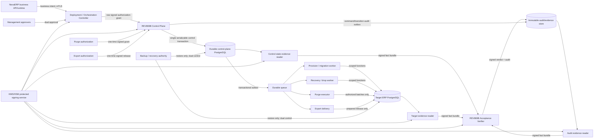

# REV869B Option-A Phase-1 architecture-freeze specification

## Executive decision

`ARCHITECTURE_FREEZE_SPECIFICATION_PASS_PENDING_MANAGEMENT_APPROVAL`

This specification resolves the eight architecture decisions required by the Correction 1 failure reconciliation. It retains Option A—SESS-owned source with separately deployed Control Plane and Acceptance Verifier—but replaces ambiguous interface-only behavior with one explicit production ownership model.

The durable control-plane PostgreSQL database is the sole transactional authority for commands, nonces, idempotency, authorizations, leases/fences, lifecycle versions, execution attempts, recovery, quarantine, purge, export state, and the transactional audit outbox. No transaction spans that database and a target ERP database. Target work is a durable, fenced saga dispatched from the outbox; workers report signed outcomes, and only the Control Plane may commit lifecycle transitions.

This is a design approval candidate, not implementation authority. Correction 2 and Phase A remain NO_GO until management approves this architecture and separately authorizes Phase A's exact boundary.

Canonical states:

`phase1_architecture_freeze_specification_state=PASS_PENDING_MANAGEMENT_APPROVAL`

`phase1_architecture_management_approval_state=PENDING`

`phase1_correction2_source_only_gate=NO_GO`

`phase_a_source_only_gate=NO_GO_PENDING_MANAGEMENT_APPROVAL`

`rev869b_source_safety_state=FAIL`

`rev869b_execution_helper_readiness_state=FAIL`

`external_provisioning_state=NOT_STARTED`

`postgresql_execution_state=NOT_AUTHORIZED_NOT_RUN`

`production_readiness_state=NOT_READY`

## Entry-gate evidence

| Gate | Evidence | Result |
|---|---|---|
| Expected HEAD | `7c87b510ffdc6d5f2edaf821d385185b5f987cf5` | PASS |
| Required parent | `d9edba21ba2d34209ee0794f244520bc6dc0b028` | PASS |
| HEAD boundary | exactly one added failure-reconciliation report | PASS |
| Reconciliation path | `outputs/rev869b_external_controller_phase1_correction1_failure_reconciliation.md` | PASS |
| Reconciliation SHA-256 | `E4D02A4983F0FC013F81BB102431C64653DF6E3405887EEEEDEB8CAF232E7735` | PASS |
| Required decision | `ARCHITECTURE_FREEZE_REQUIRED` | PASS |
| Required Correction 2 gate | `NO_GO` | PASS |
| Target-scoped worktree | clean at entry | PASS |
| `../legacy-reference/` | remained untracked; contents not accessed, enumerated, or modified | PASS |
| History preservation | no reset, rebase, amend, stash, or rewrite | PASS |

The following authoritative inputs were read completely:

1. `outputs/rev869b_external_controller_architecture_freeze_review.md`
2. `outputs/rev869b_external_controller_phase1_checkpoint.md`
3. `outputs/rev869b_external_controller_phase1_independent_source_safety_review.md`
4. `outputs/rev869b_external_controller_phase1_correction1_checkpoint.md`
5. `outputs/rev869b_external_controller_phase1_correction1_independent_source_safety_review.md`
6. `outputs/rev869b_external_controller_phase1_correction1_failure_reconciliation.md`

## Frozen principles

1. The NexaERP business API may request business work but is never lifecycle, trust-policy, purge, export-release, or acceptance authority.
2. A separately operated Deployment/Orchestration Controller obtains management authorization and issues a signed, single-purpose authorization grant. The grant contains no caller-selected trusted role.
3. The Control Plane verifies the raw grant and authenticated caller, derives authority from a signed policy bundle, owns the durable command record, and alone changes lifecycle state.
4. Control Plane signing attests an already authorized internal command; it does not create authorization.
5. Workers can execute only one exact signed job and cannot update lifecycle state directly.
6. The Acceptance Verifier is separately deployed, separately keyed, and alone calculates and signs a verdict from authenticated authoritative facts. The caller, Control Plane, and readers never submit PASS/FAIL.
7. The durable control database survives every target-database lifecycle event. Process memory, queues, target databases, and object storage are not workflow authority.
8. Immutable audit/evidence storage is append-only and independently administered. A purge executor cannot purge audit evidence.
9. Every production dependency is fail closed. Protected handlers do not execute when trust, time, durable state, audit, or required evidence dependencies are unavailable.
10. Company ledger data is company-scoped at policy and query layers. Shared masters require explicit grants and never imply cross-company ledger access.

## Component, data, and trust topology

### Component ownership

| Component | Production owner | Data owned | Explicitly not owned |
|---|---|---|---|
| NexaERP business API/runtime | ERP Product Engineering | business intent and normal ERP transactions | lifecycle state, trusted roles, keys, verdicts, purge/export approval |
| Deployment/Orchestration Controller | Platform Operations; management approval policy owned by Risk/Management | authorization requests, approval chain, signed one-time grants | lifecycle mutation, target SQL, verifier result |
| REV869B Control Plane | Control Plane Engineering | command/control records and lifecycle decisions | business ledger rows, self-authorization, acceptance calculation |
| Durable control-plane PostgreSQL | DBA Operations; schema accountable to Control Plane Engineering | all authoritative workflow state and transactional audit outbox | target business data, private signing keys |
| Target ERP PostgreSQL | company ERP data owner and DBA Operations | ERP business/master/ledger data | control authority, controller keys, verifier verdicts |
| Acceptance Verifier | Independent Assurance Engineering | calculation record and signed verdict metadata | lifecycle mutation, target writes, authorization grants |
| Authoritative readers | Data Assurance Engineering with source DBA approval | transient bounded fact bundles; no long-term authority | PASS/FAIL, formulas, target mutation |
| Immutable audit/evidence store | Records & Compliance | WORM audit objects, evidence objects, hash chains, legal holds | lifecycle authority or mutable workflow state |
| KMS/HSM/protected signing service | Security Engineering | non-exportable keys, public trust bundles, rotation/revocation metadata | authorization policy, lifecycle state, evidence facts |
| Backup/recovery authority | Independent Resilience Operations | backup catalogue, restore attestations | normal runtime writes, lifecycle approval, purge approval |
| Purge authorization | dual-control Records + Data Owner function | signed candidate set/root, reason, expiry, legal-hold decision | purge execution credentials |
| Purge execution | isolated Purge Worker Operations | exact batch attempt receipts | authorization creation, audit deletion, arbitrary DML |
| Export authorization | dual-control Data Owner + Privacy function | signed export scope/release/expiry | delivery credentials or verdict calculation |
| Export delivery | isolated Export Delivery Operations | delivery attempt/receipt | authorization creation, unrestricted reads |

## Full eight-decision matrix

The decision titles and requirements below are extracted without omission, renaming, combination, or weakening from the failure reconciliation.

| # | Extracted architecture decision | Frozen selection |
|---|---|---|
| 1 | **Command trust owner:** name the component that alone constructs signing context, owns raw canonical ingress, and maps authenticated identity to a policy version. | Deployment Controller authorizes; Control Plane alone constructs internal signing context and owns raw ingress; Security-owned signed policy determines authority. |
| 2 | **Policy and tenant owner:** freeze the exact issuer/key/audience/operation/role/scope matrix, organization scope grammar, two-ledger isolation rule, and shared-master exception rule. | Security owns issuer/key/audience policy; Data Governance owns tenant/master policy; Control Plane evaluates immutable versioned bundles. |
| 3 | **Atomic commit owner:** select either one surviving control-plane transactional store with an audit outbox, or one fully specified durable saga. Name the owner of nonce, idempotency, lease/fence, lifecycle, authorization, response, and audit correlation state. | One surviving control-plane PostgreSQL transaction owns all listed state; target work uses a fenced outbox saga. |
| 4 | **Idempotency recovery rule:** freeze reservation ownership, expiry, takeover, retry caps, stored response semantics, terminal failures, and crash reconciliation. | Control DB owns exact digest-bound attempts/results; bounded takeover occurs only through the reconciler after lease expiry and fact collection. |
| 5 | **Evidence authority:** name the reader identity/key authority, canonical authoritative fact bundle, oracle build/signing owner, and immutable audit/evidence store. Caller facts must have no verdict authority. | Security issues per-reader identities/keys; DBA/Data Assurance own schemas; Assurance Release owns oracle; Records & Compliance owns WORM store. |
| 6 | **Deployment/readiness owner:** define the actual Control Plane and Acceptance Verifier deployments, protected routes, workload identities, ACLs, dependency probes, and common readiness-policy version. | Platform/SRE deploys separate HA services using one signed readiness-policy version and mandatory route guard. |
| 7 | **Independent acceptance authority:** designate the owner of frozen expected matrices, cryptographic/oracle vectors, mutation criteria, and later database evidence. | Independent Assurance owns expected results/vectors; Security owns crypto vectors; DBA Test Authority owns isolated database evidence. |
| 8 | **Enterprise data boundary:** freeze pagination token ownership, query snapshot semantics, tenant enforcement layer, bounded-ingestion model, retry/backpressure policy, and measurable scale thresholds. | Control Plane token service, source-local consistent snapshots, policy+SQL tenant enforcement, streaming limits, bounded retry, and qualification thresholds defined below. |

### Decision 1 — Command trust owner

**Problem being decided:** who creates, signs, verifies, authorizes, and consumes protected commands without self-authorization or request-supplied roles.

- **Security/business impact:** a confused-deputy or signer-with-policy-authority failure could execute destructive cross-company work.
- **Options considered:** Control Plane self-authorization; caller-signed role claims; external grant plus Control Plane command sealing.
- **Selected option:** the Deployment/Orchestration Controller issues a raw canonical one-time authorization grant after required management approval. The Control Plane's sole public protected ingress validates raw bytes, mTLS identity, grant signature, policy version, time, nonce, audience, scope, and target. It then atomically records and KMS-signs an internal worker command. Workers verify but never authorize it.
- **Rejected options:** self-authorization violates separation of duties; caller roles are untrusted; typed-object ingress permits parser bypass; shared controller/verifier keys collapse trust.
- **Production owner / data owner:** Platform Operations owns grant issuance; Security owns trust bundles; Control Plane Engineering owns ingress/command records.
- **Trust boundary / runtime identity:** `spiffe://sess.prod/rev869b/deployment-controller` to `spiffe://sess.prod/rev869b/control-plane`; internal jobs are consumed by operation-specific worker SPIFFE identities.
- **Persistence boundary:** raw grant digest, canonical command bytes/digest, policy version, authenticated identity, nonce, idempotency key, and KMS key/version are stored in the control DB transaction.
- **Failure/recovery:** any parse, trust, KMS, time, or policy failure rejects before reservation. A crash after transaction commit is recovered from outbox; no caller retry creates another business attempt.
- **Audit evidence:** grant/command digests, identity, policy, key/version, decision, typed code, timestamps, and correlation chain.
- **Availability / backup-DR:** three Control Plane instances; trust bundles cached only while valid; keys and public bundles available cross-region; control records covered by control DB PITR.
- **Scale implications:** raw envelope ≤96 KiB; validation is streaming/bounded; no header or payload is accepted as an unbounded object first.
- **External prerequisite:** Deployment Controller, KMS/HSM, workload identity, signed policy distribution, trusted clock.
- **Source impact:** remove public typed verification and arbitrary-header signing; introduce trusted grant/context types and one raw ingress.
- **Acceptance evidence:** 25-field mutation matrix, framing/order vectors, no-public-bypass reflection test, independent production-algorithm vectors, role substitution negatives.

### Decision 2 — Policy and tenant owner

**Problem being decided:** exact ownership and semantics of issuer/key/audience/operation/role/scope and company/shared-master policy.

- **Security/business impact:** broad set membership can permit cross-ledger access or privilege substitution.
- **Options considered:** request-selected roles; Control Plane-local mutable policy; signed jointly governed policy bundles.
- **Selected option:** Security publishes issuer/key/algorithm/audience/subject-class policy; Data Governance publishes organization, ledger, resource, and shared-master grants. A signed compatibility manifest binds both bundle hashes. Control Plane evaluates exactly one matching row; zero or multiple matches deny.
- **Rejected options:** request roles are not authority; mutable local policy is unaudited; global scope never implicitly includes a company ledger.
- **Production owner / data owner:** Security owns identity policy; Data Governance and company data owners own tenant/resource policy; Control Plane is read-only evaluator.
- **Trust boundary / runtime identity:** policy signing identities are distinct from Control Plane and callers. Bundles are fetched over mTLS and verified from pinned roots.
- **Persistence boundary:** immutable policy version/hash and effective row ID are recorded with each authorization; bundles reside in signed artifact storage with verified cache metadata in control DB.
- **Failure/recovery:** missing, expired, ambiguous, revoked, or incompatible policy yields `SERVICE_NOT_READY` or exact denial; previous bundle is usable only until its signed expiry.
- **Audit evidence:** input identity, bundle hashes, matched row, organization/resource scope, decision, and denial code without sensitive claims.
- **Availability / backup-DR:** signed bundles replicated cross-region; policy expiry exceeds planned DR window but never permits revoked keys.
- **Scale implications:** policy indexes by issuer, audience, operation, subject class, organization, and resource class; evaluation is bounded and exact-key based.
- **External prerequisite:** identity provider, policy signing, tenant catalogue, IAM/ACL realization.
- **Source impact:** typed scope grammar `ORG:<id>`, `GLOBAL_MASTER:<class>`, explicit shared-master verbs, exact role/audience matrix; no role grant in request.
- **Acceptance evidence:** exhaustive independently authored allowed/complement matrix and two-company/shared-master negative tests.

### Decision 3 — Atomic commit owner

**Problem being decided:** eliminate non-atomic command updates across nonce, idempotency, lease/fence, lifecycle, authorization, audit, and response stores.

- **Security/business impact:** partial writes can duplicate destructive work or leave unverifiable lifecycle state.
- **Options considered:** independent stores; distributed transaction across control/target databases; one control transaction plus outbox saga.
- **Selected option:** one HA control-plane PostgreSQL database and one serializable transaction per control decision. It atomically updates nonce/idempotency ownership, authorization consumption, resource version, lease/fence, attempt, lifecycle state, response metadata, audit event, and outbox message. Target execution is a separate idempotent saga step; its signed receipt is later consumed by another control transaction.
- **Rejected options:** independent stores recreate Correction 1 failure; distributed transactions couple target availability to control authority and do not survive target loss.
- **Production owner / data owner:** Control Plane Engineering owns transaction semantics/schema; DBA Operations owns database service; only Control Plane DB role can call transition functions.
- **Trust boundary / runtime identity:** `spiffe://sess.prod/rev869b/control-plane` uses `nexa_rev869b_lifecycle_api`; workers cannot write lifecycle tables.
- **Persistence boundary:** control DB is authoritative; queue is delivery transport; WORM store is immutable evidence; target DB owns only target mutation and local action receipt.
- **Failure/recovery:** local failure rolls back completely. Outbox dispatcher retries. Target ambiguity enters `Interrupted/ReconciliationPending`; reconciler reads authoritative target facts before resume, quarantine, or fresh authorization.
- **Audit evidence:** every transaction appends a hash-linked event and outbox row sharing transaction ID, resource version, attempt, and correlation ID.
- **Availability / backup-DR:** HA primary/standby; design target RPO ≤5 minutes, RTO ≤60 minutes; no protected writes during uncertain leadership.
- **Scale implications:** partition events/outbox by month and company hash; serialize per resource, not globally; queue partitions by company/instance.
- **External prerequisite:** managed PostgreSQL, durable queue, archive writer, replication/PITR, reconciliation workers.
- **Source impact:** replace independent mutation calls with one `IControlPlaneTransaction` operation and explicit saga/outbox/result contracts.
- **Acceptance evidence:** fault injection at every boundary, restart reconciliation, unique terminal outcome, audit/outbox correlation, concurrent database sessions.

### Decision 4 — Idempotency recovery rule

**Problem being decided:** stable behavior for first request, replay, collision, concurrency, retryable/non-retryable failure, expiry, and crash.

- **Security/business impact:** duplicate financial/destructive action or indefinite stuck ownership.
- **Options considered:** nonce-only rejection; caller-controlled retries; durable digest-bound attempt ownership with reconciler takeover.
- **Selected option:** unique binding `(issuer, organization, database_instance, operation, request_id, idempotency_key)` plus canonical request digest. States are `IN_PROGRESS`, `COMPLETED`, `RETRYABLE_FAILURE`, `NONRETRYABLE_FAILURE`. Exact completed replay returns stored response/audit without execution; changed digest denies; live duplicate returns in-progress; only reconciler may take over an expired owner after fact checks.
- **Rejected options:** Boolean replay cannot return prior result; automatic new destructive attempts can double-execute.
- **Production owner / data owner:** Control Plane transaction module owns rows; Reconciler owns takeover; operation-specific workers own no idempotency authority.
- **Trust boundary / runtime identity:** only Control Plane role creates/completes; reconciler has a separate function-limited role; workers return signed receipts.
- **Persistence boundary:** idempotency binding, attempt number, owner epoch/lease, response digest/location, failure class, and audit reference in control DB.
- **Failure/recovery:** same attempt resumes when target facts prove safe. Provision/migration/recovery permit at most three same-attempt dispatch retries. Drop/purge never creates a new attempt automatically; export delivery retries the same release at most three times. A new attempt requires a new signed authorization where specified.
- **Audit evidence:** reserve, replay, collision, takeover, retry, completion, terminal denial, and response retrieval events.
- **Availability / backup-DR:** rows retained for ten years for lifecycle/destructive/export commands; nonces retained through expiry plus skew and reconciliation margin. Restores increment controller epoch before dispatch.
- **Scale implications:** unique composite index plus organization/time partitions; response bodies content-addressed outside hot rows.
- **External prerequisite:** transactional store, isolation tests, restart/concurrency environment.
- **Source impact:** complete state-specific service branches, stable typed outcomes, stored-result return, failure recording, retry caps.
- **Acceptance evidence:** first/replay/collision/nonce/concurrent/retryable/nonretryable/expired/crash matrices through real service and future PostgreSQL.

### Decision 5 — Evidence authority

**Problem being decided:** who owns reader identity, canonical facts, oracle artifact, verdict, and immutable evidence.

- **Security/business impact:** caller facts or permissive readers/oracles can fabricate acceptance.
- **Options considered:** caller evidence; Control Plane-calculated verdict; separately authenticated facts and independent verifier.
- **Selected option:** per-source readers create signed `REV869B-AUTHORITATIVE-FACTS-v1` bundles. Acceptance Verifier validates reader identity/version/artifact, source binding, schema, snapshot/watermark, time, scope, bounds, and signature, then builds oracle input only from those facts. Assurance Release owns a reproducible signed oracle artifact. Verifier alone calculates and signs the verdict.
- **Rejected options:** caller PASS/expected/formula fields are rejected; Control Plane verdict violates independence; self-hashes do not authenticate evidence.
- **Production owner / data owner:** Security owns reader identities/keys; DBA/Data Assurance own allowed fact schemas; Assurance Release owns oracle; Records & Compliance owns WORM evidence.
- **Trust boundary / runtime identity:** separate identities `.../reader/control`, `.../reader/target`, `.../reader/audit`, and `.../acceptance-verifier`; no shared private key.
- **Persistence boundary:** facts are bounded signed bundles stored content-addressed in WORM; control DB stores hashes/URIs/receipts; verdict metadata is append-only.
- **Failure/recovery:** missing/duplicate/unknown/stale/out-of-scope/tampered/oversized/private evidence denies without verdict. Reader outage makes verifier NOT_READY for affected operations. Retry reads a new bundle linked to the same execution and stage.
- **Audit evidence:** reader/artifact/schema/signature, source identity, snapshot/watermark, fact digest, oracle/version/hash, exact input digest, reasons, verdict signature.
- **Availability / backup-DR:** readers are independently scalable; oracle/trust artifacts replicated; WORM cross-region; design target verifier RTO ≤60 minutes.
- **Scale implications:** ≤4 MiB evidence envelope, ≤512 observations, ≤128 selectors, ≤256 facts/observation, ≤4 KiB/string, ≤2 MiB cumulative fact bytes; stream before materialization.
- **External prerequisite:** reader deployments, least-privilege DB functions, KMS, oracle build/signing, WORM store.
- **Source impact:** authoritative-fact envelope/signatures; eliminate caller raw facts from oracle input; duplicate/time/privacy/bounds enforcement; signed verdict.
- **Acceptance evidence:** independent PASS/FAIL vectors, caller-conflict test, receipt tamper/duplicate matrix, allocation bounds, deployed reader ACL tests.

### Decision 6 — Deployment/readiness owner

**Problem being decided:** actual deployment, identities, protected routes, ACLs, probes, and common readiness policy.

- **Security/business impact:** a nominally healthy service can execute with missing trust or durability.
- **Options considered:** static NOT_READY; application-local ad hoc checks; signed shared readiness policy with component-specific probes and a route guard.
- **Selected option:** Platform/SRE owns separate HA deployments. `REV869B-READINESS-v1` is a signed compatibility artifact. Every protected route first evaluates the component's conjunctive snapshot; any false/stale row returns HTTP 503 and invokes no handler.
- **Rejected options:** static status cannot prove dependencies; OR aggregation or route-local checks permit bypass.
- **Production owner / data owner:** Platform/SRE owns deployment/probes; each dependency owner owns its health assertion; Security signs policy.
- **Trust boundary / runtime identity:** distinct SPIFFE identity, namespace/service account, network policy, DB role, KMS grant, and key per component.
- **Persistence boundary:** readiness incidents/versions in telemetry and audit; they are not lifecycle authority.
- **Failure/recovery:** no new protected work when config, trust, time, DB, KMS, queue, audit, oracle, readers, target identity, or ACL checks fail. Existing attempts enter safe reconciliation after dependencies recover.
- **Audit evidence:** sanitized dependency code, policy version, transition READY↔NOT_READY, protected invocation count.
- **Availability / backup-DR:** Control Plane 3 instances; Verifier 2; multi-zone; cross-region artifacts/keys; readiness remains false during promotion until epoch and reconciliation complete.
- **Scale implications:** probes are bounded/cached briefly, never issue full-table queries, and are rate limited.
- **External prerequisite:** orchestration platform, mTLS identity, private networking, KMS, telemetry, all production dependencies.
- **Source impact:** real aggregators, dependency interfaces, middleware guard, startup validation, HTTP integration tests.
- **Acceptance evidence:** one-missing/invalid/stale dependency per row for both hosts and zero protected-handler invocation.

### Decision 7 — Independent acceptance authority

**Problem being decided:** who owns expected matrices, crypto/oracle vectors, mutation criteria, and database evidence independently of implementation.

- **Security/business impact:** circular tests can approve weakened code.
- **Options considered:** implementation-derived expectations; developer-owned permissive fakes; independent assurance artefacts and mutation gates.
- **Selected option:** Assurance Engineering owns frozen transition/trust/oracle expectation files and test review; Security Engineering owns canonical/cryptographic vectors; DBA Test Authority owns isolated PostgreSQL expected outcomes; Product Data Owners approve business invariants. Implementers cannot change expected artifacts in the same implementation phase without separate approval.
- **Rejected options:** production enumeration as expected truth, unconditional-PASS oracle, fake-only concurrency/readiness.
- **Production owner / data owner:** Assurance is acceptance owner; source owners supply code but not expected results; evidence archive owned by Records & Compliance.
- **Trust boundary / runtime identity:** CI acceptance runner is separate, read-only to source after checkout, uses non-production test identities/keys and isolated databases.
- **Persistence boundary:** signed expected artifact hashes, test results, mutation report, build provenance, database receipts, and review decision in immutable CI archive.
- **Failure/recovery:** any surviving decisive mutant, changed expected artifact, generic exception assertion, flaky concurrency row, or missing evidence blocks the phase.
- **Audit evidence:** commit/artifact/SBOM hashes, vector versions, exact test totals, mutant IDs, database fixture IDs, reviewer identity.
- **Availability / backup-DR:** acceptance evidence retained ten years; CI can be rebuilt from locked source and artifacts; no production dependency for offline phases.
- **Scale implications:** scale tests use representative cardinalities and publish measured allocations/query plans; no synthetic claim becomes evidence.
- **External prerequisite:** isolated CI, mutation tooling, production-algorithm test KMS, isolated PostgreSQL, independent reviewers.
- **Source impact:** independently authored fixtures/vectors, real public paths, exact typed/no-change assertions, fault injection.
- **Acceptance evidence:** all named positive/negative tests and decisive mutants from the reconciliation, separated into offline and future database gates.

### Decision 8 — Enterprise data boundary

**Problem being decided:** pagination, snapshots, tenancy, bounded ingestion, retries/backpressure, and measurable scale thresholds.

- **Security/business impact:** resource exhaustion, inconsistent evidence, token substitution, or cross-company leakage.
- **Options considered:** offset paging/full materialization; unsigned continuation values; signed snapshot-bound tokens plus streaming readers.
- **Selected option:** a Control Plane token service signs opaque tokens bound to issuer, subject, organization, database/resource, query/schema version, snapshot/watermark, page size, expiry, and prior-page digest. Source-local readers use repeatable-read snapshots or immutable event watermarks. Cross-database evidence is temporally ordered by signed action receipts and per-source watermarks, never falsely described as one distributed snapshot.
- **Rejected options:** offsets drift; unsigned tokens substitute scope; full loads violate bounds; global scope cannot cross ledgers.
- **Production owner / data owner:** Control Plane owns token contract; source DBAs own snapshot/query functions; Data Governance owns tenant enforcement; SRE owns capacity thresholds.
- **Trust boundary / runtime identity:** reader identities have function/view execute only; company ID is derived from authorization and enforced again in SQL.
- **Persistence boundary:** token state is stateless but signed; snapshot/watermark and page-chain digests are recorded in evidence metadata; source data stays in source DB.
- **Failure/recovery:** invalid/expired/substituted token denies; snapshot loss restarts a new evidence attempt; cancellation propagates; backpressure stops reads; retries remain bounded.
- **Audit evidence:** token key/version, scope/query/snapshot/page digest, row/byte counts, elapsed time, cancellation/retry result.
- **Availability / backup-DR:** readers scale independently; snapshots are short-lived; durable watermarks allow reconstruction; restore identity must be re-attested before reads.
- **Scale implications:** page size ≤1,000; statement timeout ≤30 seconds; ≤3 transient read retries with jitter; bounded connection pools/queues; no full master/ledger materialization.
- **External prerequisite:** query functions/indexes, token KMS key, representative data, performance/chaos environment.
- **Source impact:** opaque token contract, streaming parsers/readers, tenant scope types, retry/cancellation/backpressure policy.
- **Acceptance evidence:** 10,000,000-item traversal with no gaps/duplicates, peak-memory target, wrong-token matrix, cancellation, query-plan and two-company isolation results.

## Command, key, time, and policy flow

1. The ERP runtime submits an unsigned business intent over mTLS; it supplies no trusted role/scope.
2. The Deployment Controller authenticates the request, obtains required management/dual approvals, resolves the signed policy bundle, and asks its non-exportable KMS key to sign a canonical one-time authorization grant.
3. The Control Plane accepts only bounded raw bytes. It strictly parses and regenerates the canonical grant, verifies issuer/key/algorithm/version/audience/time/nonce/signature, maps authenticated subject to exactly one policy row, and verifies organization/resource binding.
4. In one control DB transaction it reserves nonce/idempotency, binds authorization, updates resource/attempt state, appends audit/outbox, and stores the response digest.
5. The Control Plane KMS key signs the internal operation-specific job. This signature attests the immutable command and grant reference; it cannot add authority.
6. The exact worker verifies signature/audience/operation/target/lease/fence/version, executes only its allowlisted target function, and signs a bounded receipt.
7. The Control Plane validates the receipt and authoritative facts, then alone advances state in a new control transaction.
8. For acceptance, readers send signed facts directly to the Acceptance Verifier or through content-addressed WORM storage. The verifier loads the pinned oracle, calculates, signs, archives, and returns the verdict receipt; the Control Plane consumes only a valid verifier verdict.

### Registries and key lifecycle

- Security owns issuer, audience, key, algorithm, canonicalization, purpose, and revocation registries as signed versioned bundles.
- Distinct non-exportable keys exist for Deployment Controller grants, Control Plane jobs, Acceptance Verifier verdicts, each reader class, audit writer, and pagination tokens. Private keys never enter source, images, PostgreSQL, logs, or ordinary environment variables.
- Rotation publishes the new public key and compatibility bundle, verifies all consumers READY, activates signing, retains prior verification material for replay/audit retention, and then retires signing. Emergency revocation immediately makes affected protected routes NOT_READY.
- Envelope lifetime design target is five minutes with at most 30 seconds accepted clock skew. Time comes from platform time synchronization with at least three sources; skew/unsynchronized state fails readiness. Monotonic timers govern local elapsed time; signed UTC timestamps govern cross-service validity.

## Durable data ownership and transaction model

| Durable record | Authoritative store/owner | Key invariant | Retention design target |
|---|---|---|---|
| Nonce | control DB / Control Plane | unique issuer+nonce; expires only after message and reconciliation margin | expiry + 24 hours |
| Idempotency request/result | control DB / Control Plane | unique complete binding; one digest and terminal response | 10 years for protected lifecycle operations |
| Authorization grant/consumption | control DB / Deployment Controller grant, CP consumption | complete binding; one-time; immutable grant digest | 10 years |
| Lease/fence | control DB / Control Plane | one current resource lease; strictly increasing fence and controller epoch | current + 10-year event history |
| Lifecycle/resource version | control DB / Control Plane | one legal transition per expected version | permanent current row + 10-year events |
| Execution attempt | control DB / Control Plane | one authoritative owner/outcome per operation boundary | 10 years |
| Recovery/quarantine | control DB / Control Plane and Recovery Approver | fresh one-time decision; no silent resume | 10 years |
| Purge authorization/execution | control DB / separate authorizer and executor | candidate root/version/hold decision bound; batches idempotent | 10 years plus legal hold |
| Export authorization/delivery | control DB / separate authorizer and delivery | prepared immutable batch; one-time release; delivery receipt | 10 years |
| Audit outbox | control DB / Audit Writer | same transaction as decision; append-only dispatch | until WORM receipt + reconciliation margin |
| WORM audit/evidence | immutable store / Records & Compliance | object lock, encryption, versioning, hash chain, no update/delete by runtime | minimum 10 years; legal hold overrides expiry |

All control mutations execute through reviewed stored functions or parameterized transaction methods under `nexa_rev869b_lifecycle_api`. The transaction uses a resource row lock plus serializable conflict detection and database uniqueness constraints. Queue delivery cannot authorize state. Target mutation functions accept exact request/attempt/lease/fence and are locally idempotent; their result receipt and transaction/event watermark are authoritative facts, not control state.

## Complete lifecycle transition matrix

Every row requires the exact current resource version and policy/grant binding. “Lease” means current lease ID, unexpired lease, matching holder, controller epoch, and fencing token. Any row not listed returns `STATE_TRANSITION_ILLEGAL` and changes nothing.

| Current state/substate | Operation | Authorized identity | Required evidence | Lease/fence/version | Next state/substate | Failure state | Retry behavior | Audit event |
|---|---|---|---|---|---|---|---|---|
| Registered | AUTHORIZE_PREPARE | Management Operator via Deployment Controller | target registration and identity manifest | version; no lease | Preflight + active prepare authorization | Registered | new grant after denial/expiry | `prepare_authorized` |
| Preflight | PREPARE | ProvisioningExecutor | identity/TLS/catalog/ACL preflight facts | lease+fence+version | Provisioning; authorization consumed | Failed or Quarantined on identity mismatch | resume same attempt ≤3 | `prepare_started` |
| Provisioning | COMPLETE_PREPARE | ProvisioningExecutor | signed action receipt + authoritative ready facts | lease+fence+version | Ready | Failed/Quarantined | reconcile same attempt | `prepare_completed` |
| Provisioning | FAIL | ProvisioningExecutor | signed terminal failure facts | lease+fence+version | Failed | Quarantined if facts conflict | terminal; fresh authorization | `prepare_failed` |
| Ready | AUTHORIZE_EXECUTE | Management Operator via Deployment Controller | exact migration/source/manifest/target plan | version; no lease | MigrationAuthorized + active execute authorization | Ready | new grant after denial/expiry | `execute_authorized` |
| MigrationAuthorized | EXECUTE | MigrationExecutor | active bound authorization and preflight facts | lease+fence+version | Migrating; authorization consumed | Quarantined before mutation if mismatch | resume same attempt ≤3 | `execute_started` |
| Migrating | COMPLETE_EXECUTE | MigrationExecutor | signed receipt + migration ledger facts | lease+fence+version | VerificationPending | Failed/Quarantined | reconcile same attempt | `execute_completed` |
| Migrating | FAIL | MigrationExecutor | signed terminal failure/rollback facts | lease+fence+version | Failed | Quarantined if outcome ambiguous | terminal; fresh recovery | `execute_failed` |
| VerificationPending | VERIFY_ACCEPT | AcceptanceVerifier | signed verdict PASS, oracle/hash, authoritative bundle hashes, WORM receipt | lease+fence+version | Accepted | Failed if signed FAIL; Quarantined if binding conflict | new evidence attempt only | `verification_accepted` |
| VerificationPending | VERIFY_REJECT | AcceptanceVerifier | signed verdict FAIL and exact reasons | lease+fence+version | Failed | Quarantined if unverifiable | terminal; fresh recovery | `verification_rejected` |
| Any nonterminal except Purged | QUARANTINE | ControlPlaneRuntime/Reconciler | identity/evidence/fence/policy inconsistency | version; lease when held | Quarantined | Quarantined | no auto-exit | `resource_quarantined` |
| Quarantined | AUTHORIZE_RECOVER | RecoveryApprover via Deployment Controller | diagnosis, target identity, recovery plan, approvals | version; no lease | RecoveryAuthorized + one-time grant | Quarantined | new grant after expiry | `recovery_authorized` |
| RecoveryAuthorized | RECOVER | RecoveryExecutor | active recovery grant and authoritative before facts | lease+fence+version | Recovering; grant consumed | Quarantined | resume same attempt ≤3 | `recovery_started` |
| Recovering | COMPLETE_RECOVER | RecoveryExecutor | signed receipt + authoritative restored/ready facts | lease+fence+version | Ready | Failed/Quarantined | reconcile same attempt | `recovery_completed` |
| Recovering | FAIL | RecoveryExecutor | signed terminal failure facts | lease+fence+version | Failed | Quarantined if ambiguous | terminal; fresh grant | `recovery_failed` |
| Accepted, Failed, or Quarantined | AUTHORIZE_DROP | DropAuthorizer via dual approval | target identity, retention/backup evidence, no active use, exact reason | version; no lease | DropAuthorized + one-time grant | unchanged | new grant only | `drop_authorized` |
| DropAuthorized | DROP | DropExecutor | active drop grant, backup/hold attestation, target facts | lease+fence+version | Dropped | Quarantined if ambiguous | resume same attempt only; never new automatically | `drop_completed` or `drop_interrupted` |
| Dropped | AUTHORIZE_PURGE | PurgeAuthorizer via Records+Data Owner | immutable candidate root, legal-hold denial check, retention approval | version; no lease | PurgeAuthorized + one-time grant | Dropped | new grant only | `purge_authorized` |
| PurgeAuthorized | PURGE | PurgeExecutor | exact candidate root/batches and active grant | lease+fence+version | Purging; grant consumed | Dropped/Quarantined | resume same idempotent batches only | `purge_started` |
| Purging | COMPLETE_PURGE | PurgeExecutor | zero remaining authorized candidates + per-batch audit | lease+fence+version | Purged | Dropped/Quarantined | reconcile; no new candidates | `purge_completed` |
| Purging | FAIL | PurgeExecutor | signed batch failure and remaining-root facts | lease+fence+version | Dropped | Quarantined if root drift | terminal; fresh authorization | `purge_failed` |
| Accepted / export NONE, EXPIRED, or FAILED | AUTHORIZE_EXPORT | ExportAuthorizer via Data Owner+Privacy | immutable minimized batch root, purpose, recipients, expiry | version; no lease | Accepted / AUTHORIZED | unchanged | new release only | `export_authorized` |
| Accepted / AUTHORIZED | EXPORT | ExportDelivery | active one-time release and exact batch root | lease+fence+version | Accepted / DELIVERING | FAILED | same release transport retry ≤3 | `export_started` |
| Accepted / DELIVERING | COMPLETE_EXPORT | ExportDelivery | signed recipient delivery receipt matching batch/release | lease+fence+version | Accepted / DELIVERED | FAILED | reconcile same delivery | `export_delivered` |
| Any state with unused active authorization | CANCEL | original authorizer identity | exact authorization binding and cancellation reason | version; no lease | same state / authorization CANCELLED | unchanged | terminal | `authorization_cancelled` |
| Any state with expired active authorization | EXPIRE | ControlPlane Reconciler | server time beyond expiry | version; no lease | same state / authorization EXPIRED | unchanged | terminal | `authorization_expired` |

Arbitrary status assignment, cross-operation authorization reuse, target-worker lifecycle writes, reused verdicts, and reusing a lease/fence across resources are prohibited.

## Authoritative evidence-reader architecture

| Reader | Runtime identity / DB role | Allowed source | Allowed operations | Scope and snapshot | Explicit denial |
|---|---|---|---|---|---|
| Control-state reader | `.../reader/control` / `nexa_rev869b_control_plane_verifier` | approved control schema views/functions | SELECT/EXECUTE exact evidence functions | resource/company/attempt; repeatable-read snapshot and event watermark | base-table DML, keys, unrelated companies |
| Target ERP reader | `.../reader/target` / `nexa_rev869b_target_verifier` | approved REV869B fact functions/views | EXECUTE only with bound parameters | exact database/company/resource; repeatable-read snapshot and LSN/transaction watermark | base tables, writes, security schema, cross-company rows |
| Audit reader | `.../reader/audit` / immutable-store read policy | WORM audit/evidence objects | read exact object/hash chain | execution/event IDs and retention authorization | list-all, write/delete, private payload export |
| Backup catalogue reader | `.../reader/backup` / backup-attestation read policy | backup catalogue/restore attestations | exact target backup identity/status | target/version/time | restore execution or unrelated backup content |

Raw fact schema contains only typed field ID, typed scalar value, source identity, reader/artifact/schema versions, organization/database/resource/operation/request/attempt binding, stage (`Before`, `Action`, `After`, `Durable`, `Cleanup`), observation ID/time, snapshot/watermark, row/count/byte totals, and canonical digest/signature. It contains no `pass`, `fail`, `verdict`, `disposition`, `expected`, formula, oracle operator, or free-form SQL.

Within a source, all facts for one stage use one consistent snapshot. Across sources, no distributed-snapshot claim is made: before precedes the signed action dispatch; action receipt binds the target transaction/event; after is a later committed snapshot; durable facts are taken after restart/replication visibility; cleanup is separate. Missing, duplicate, unknown, future, stale, out-of-order, oversized, private, or scope-mismatched evidence denies.

## Audit and evidence durability

- Every grant, denial, command, replay, collision, authorization, lease/fence decision, transition, worker receipt, verifier calculation, export delivery, recovery, drop, and purge action creates a typed hash-linked event in the same control transaction when applicable.
- The Audit Writer reads the transactional outbox and writes encrypted WORM objects with object lock, versioning, cross-region replication, event hash, prior-chain hash, source transaction ID, signing key/version, and ingestion receipt.
- Verifier evidence and verdicts are content-addressed; control DB stores only minimized metadata, digests, and immutable locations.
- Retention is at least ten years. Legal hold prevents lifecycle deletion. Only Records & Compliance may define retention; runtime, DBA, purge, export, and backup identities cannot shorten it.
- Encryption uses managed keys distinct from command/verdict keys. Key policies require dual control for administrative changes.
- Restore drills verify object versions, hash chains, signatures, access policies, and control-record correlations. Restored evidence is never overwritten into the active archive namespace.
- Export of audit/evidence requires a separate privacy/records authorization, minimized scope, watermark, recipient binding, and immutable delivery receipt.

## Deployment, identity, network, role, and ACL topology

| Service | Deployment/network path | mTLS identity | DB role | Allowed operations | Explicitly denied | Secret/key source | Log/audit destination | Readiness dependencies |
|---|---|---|---|---|---|---|---|---|
| NexaERP API/runtime | ERP private segment → Deployment Controller only | `.../erp-runtime` | existing bounded app role | business intent/normal ERP DML | lifecycle, trust roles, purge/export approval, verifier | workload identity/secret manager | ERP logs + intent audit | normal ERP dependencies; no controller authority |
| Deployment Controller | separate HA platform namespace; private ingress | `.../deployment-controller` | `nexa_rev869b_management_writer` via function only | record approvals, issue one-time grants | lifecycle execution/state updates, target DML | distinct KMS grant key | control audit/WORM | policy, KMS, clock, control DB, audit |
| Control Plane | 3+ instances, private LB, separate namespace | `.../control-plane` | `nexa_rev869b_lifecycle_api` | verified command/control transaction, readback | target DB, owner/superuser, self-authorization | CP KMS job key | operational telemetry + WORM outbox | config, trust, KMS, clock, DB, queue, audit, ACL/epoch |
| Acceptance Verifier | 2+ instances, no public ingress | `.../acceptance-verifier` | no target/control mutation role | verify readers/oracle, sign verdict | lifecycle mutation, target writes, caller facts | separate verdict KMS key | verifier telemetry + WORM | config, trust, oracle, readers, KMS, clock, audit |
| Provision/migration worker | isolated worker pool | `.../worker/provision` | `nexa_rev869b_lifecycle_administrator` | exact approved functions for one target/job | general SQL, policy, lifecycle table writes | short-lived DB credential | worker receipt + audit | queue, CP signature, target identity/ACL, clock |
| Recovery/drop worker | isolated worker pool | `.../worker/recovery-drop` | `nexa_rev869b_recovery_executor` plus operation-limited elevation | exact recovery/drop workflow | authorization creation, purge, business DML | short-lived credential | signed receipt + WORM | queue, grant, backup attestation, target identity |
| Purge authorizer | separate approval service boundary | `.../purge-authorizer` | management-writer purge function | approve exact root/batches after hold check | delete/execute purge | authorization KMS key | WORM | records policy, hold service, KMS, audit |
| Purge executor | isolated worker pool | `.../purge-executor` | `nexa_rev869b_purge_worker` | exact authorized purge batches | create authorization, audit delete, general DML | short-lived credential | per-batch WORM audit | queue, grant/root, target ACL, audit |
| Export authorizer | separate approval boundary | `.../export-authorizer` | management-writer export function | approve minimized batch/release | read/deliver export | authorization KMS key | WORM | privacy policy, KMS, audit |
| Export delivery | isolated egress pool with allowlisted recipients | `.../export-delivery` | `nexa_rev869b_export_service` | read exact prepared batch; deliver once | arbitrary table reads, authorize release | short-lived DB and destination credentials | delivery receipt/WORM | release, recipient allowlist, audit, egress policy |
| Control evidence reader | separate reader deployment | `.../reader/control` | `nexa_rev869b_control_plane_verifier` | exact fact functions | mutation/base tables | reader KMS key | evidence WORM | schema/ACL, DB, KMS, clock |
| Target evidence reader | separate reader deployment | `.../reader/target` | `nexa_rev869b_target_verifier` | exact fact functions | mutation/base tables/cross-company | reader KMS key | evidence WORM | target identity/schema/ACL, KMS, clock |
| Audit writer | independent deployment | `.../audit-writer` | `nexa_rev869b_lifecycle_audit` read/ack functions | consume outbox, append WORM, acknowledge receipt | lifecycle mutation, WORM update/delete | audit signing/encryption grants | WORM + telemetry | DB, WORM, KMS, clock, chain health |
| Backup/recovery authority | separate account/namespace; no runtime path | `.../backup-recovery` | backup/restore platform role, NO normal DB login | backup, isolated restore, attestation, approved promotion | application queries, lifecycle/purge approval | vault/KMS under dual control | immutable recovery audit | backup catalogue, KMS, isolated restore, approvals |

### PostgreSQL closure and administration

- `PUBLIC` receives no CONNECT to protected control/target databases unless explicitly required, and no schema USAGE, table/sequence privileges, or function EXECUTE on REV869B objects.
- `ALTER DEFAULT PRIVILEGES` for every owner revokes all privileges from `PUBLIC` before granting exact runtime roles. New functions are not executable by `PUBLIC`.
- Runtime roles are LOGIN, NOINHERIT, non-owner, non-superuser, no `CREATEDB`, `CREATEROLE`, replication, or bypass-RLS. Ownership roles are NOLOGIN.
- Direct table writes are denied; reviewed functions enforce resource version, organization, authorization, lease/fence, attempt, and row-count bounds.
- Human administration uses named SSO/MFA identities, ticket-bound just-in-time elevation, session recording, dual approval for destructive/restore/key actions, and immutable audit.
- Break glass is time-limited, two-person approved, cannot disable WORM/legal hold, alerts immediately, and requires post-event reconciliation and independent review before readiness returns.

## Readiness, failure recovery, and disaster recovery

### Conjunctive readiness

| Component | All required READY facts | Any missing/invalid/stale fact |
|---|---|---|
| Control Plane | signed config/policy/compatibility; mTLS identity; issuer/key/algorithm/audience policy; clock; control DB read/write/epoch; queue/outbox; KMS sign/verify; audit writer/WORM lag; ACL fingerprint; target registry | HTTP 503; protected handler not invoked; no new reservation/dispatch |
| Acceptance Verifier | signed config; identity; reader registry/artifacts; oracle version/hash; KMS verdict key; clock; evidence bounds/privacy policy; WORM/audit; target/control identity pins | HTTP 503; no oracle call and no verdict |
| Deployment Controller | approval policy; approver identities; grant KMS key; clock; control DB grant function; audit | no grant issued; HTTP 503 |
| Workers | queue identity; CP trust bundle; operation grant; target identity/ACL/schema; lease/fence/epoch; clock; receipt signer/audit | no target action; message remains/reconciles safely |
| Readers | source identity/schema/ACL; snapshot capability; bounds; reader artifact/key; clock; evidence store | no fact bundle; dependent verifier operation NOT_READY |
| Audit Writer | control DB outbox; WORM object lock/versioning; KMS; chain head; clock; replication health | CP/Verifier reject new protected work after zero grace for hard failure or frozen ≤60-second transient threshold |

Liveness reports process health only. READY is never inferred from liveness. Dependency results use sanitized codes and a policy-version timestamp. Protected endpoints share one mandatory guard, not optional per-handler checks.

### Failure and recovery table

| Event | Fail-closed behavior | Recovery requirement |
|---|---|---|
| Missing/invalid configuration | startup/READY failure; no protected route | restore signed compatible config and revalidate all rows |
| Control DB unreachable | no commands, transitions, dispatch, or verdict consumption | restore connectivity/leadership; reconcile nonterminal rows before READY |
| KMS/HSM unreachable/revoked key | no grant/job/verdict/reader signing; verification follows signed revocation policy | restore approved key path or complete rotation; publish bundle; revalidate |
| Audit writer/WORM unavailable | no new protected operation; committed outbox remains durable | append/verify backlog and chain, meet lag threshold, then READY |
| Missing oracle or reader | verifier NOT_READY for affected operation; no verdict | deploy exact signed artifact/reader and verify digest/ACL |
| Clock failure/skew | no time-sensitive protected work | re-synchronize; prove stable within 30 seconds before READY |
| Split-brain controller | only DB primary epoch may write/dispatch; stale epoch/fence rejected | dual-approved DB promotion, increment epoch, fence old nodes, reconcile |
| Partial control write | transaction rollback; no outbox | retry exact request through idempotency |
| Target partial/ambiguous write | attempt `Interrupted/ReconciliationPending`; no success | authoritative facts decide resume/quarantine/fresh authorization |
| Process crash | durable leases expire; no in-memory authority | reconciler takes over only after expiry and evidence checks |
| Network partition | partitioned component NOT_READY; workers stop before target action if trust/lease cannot refresh | reconnect, verify epoch/fence/target identity, reconcile |
| Region/server loss | pause protected work; promote control DB/KMS/services under dual control | increment epoch, verify WORM/queue, reconcile every nonterminal attempt |
| Backup restoration | restored environment isolated and NOT_READY | verify hashes, schema/ACL/policy, target cluster identity; never reuse old epoch/fence; management approves promotion |

### Backup and DR targets

These are design targets, not tested evidence:

- Control DB: encrypted continuous WAL/PITR, daily full backup, multi-zone standby, cross-region copy; RPO ≤5 minutes and RTO ≤60 minutes.
- WORM audit/evidence: cross-region replication and object lock; acknowledged objects target RPO 0, service RTO ≤4 hours; ten-year retention plus legal hold.
- Trust/oracle/policy/public-key artifacts: signed cross-region replicas; RPO 0 per published version, RTO ≤60 minutes.
- Target ERP databases: company-approved PITR; target RPO/RTO recorded in registry. A restored target is quarantined until cluster/database identity and facts are re-attested.
- Quarterly control DB restore, semiannual region-failover, annual target/evidence legal-hold restore, and key-recovery exercises are required before production approval.

## Enterprise-scale design baseline

The architecture remains feasible for at least 300,000 users/customers/vendors, 10,000,000 items, 100,000 machines/projects, more than 1,000 employees, two companies, separate ledgers, approved shared masters, and ten-plus-year history. This is a design assessment, not benchmark evidence.

| Area | Frozen design target | Evidence still required |
|---|---|---|
| Tenant partitioning | company ID on every company-bound command, policy row, index, token, reader, fact, audit, and query; shared masters use explicit global IDs/grants | two-company denial tests and query/RLS/function review |
| Control partitions | monthly time partitions for events/outbox/audit metadata; hash subpartition or leading company/resource keys where measured | partition-pruning plans at representative volume |
| Indexing | unique idempotency binding; resource+version; lease resource+epoch+fence; attempt state+lease expiry; company+time; outbox state+next attempt | index-size/write-amplification/query-plan measurements |
| Pagination | signed opaque token; page ≤1,000; snapshot/watermark and prior digest bound; no offset-only production traversal | 10M traversal, wrong-token, gap/duplicate and expiry tests |
| Evidence/query bounds | raw command ≤96 KiB; evidence ≤4 MiB; 512 observations; 128 selectors; 256 facts/observation; 4 KiB/string; 2 MiB facts; statement timeout ≤30s | allocation/fuzz/timeout tests and reader query plans |
| Retry/backpressure | bounded queues/pools; ≤3 transient retries; operation-specific no-new-attempt rules; cancellation throughout | chaos, queue saturation, cancellation latency |
| Idempotency retention | ten years for protected command binding/terminal digest; large response content archived | storage-growth forecast and restore/replay test |
| Audit archival | WORM ten years, legal hold, hot metadata then archival tiers, hash verification | volume/cost model, restore and chain verification |
| Read/write scaling | stateless APIs, per-resource serialization, queue partitions by company/instance, independently scaled readers/verifier | measured throughput/latency/error budgets |
| Capacity thresholds | alert at 60% sustained and page at 75% of DB storage/IOPS/connections, queue lag, evidence throughput, WORM backlog; no auto-scale beyond tested cap | load tests establish actual safe maxima |

No benchmark result is claimed. Production GO requires measurements at or above the declared cardinalities, ten-year retention simulation, query-plan regression, peak-memory evidence, and two-company isolation.

## Bounded implementation roadmap

Every phase below is a proposal only. Management may authorize one phase at a time after its prerequisites. Completion requires a checkpoint and fresh independent review before the next phase. File counts are maximum exhaustive boundaries; no “related” or “supporting” file is implicit.

### Phase A — contracts and ownership interfaces

- **Objective:** correct raw canonical ingress, trusted grant/policy contracts, complete authorization/lifecycle/idempotency/evidence/readiness types, and independent offline expectations; no persistence or operational endpoint.
- **Projects:** ControlPlane.Contracts, ControlPlane, AcceptanceVerifier, ControlPlane.Tests.
- **Maximum boundary: 13 exact files:**
  1. `src/SESS.NexaERP.ControlPlane.Contracts/Rev869BControllerMessagesV1.cs`
  2. `src/SESS.NexaERP.ControlPlane.Contracts/Rev869BCompatibilityManifestV1.cs`
  3. `src/SESS.NexaERP.ControlPlane/Domain/Rev869BExecutionBinding.cs`
  4. `src/SESS.NexaERP.ControlPlane/Domain/Rev869BControllerStateMachine.cs`
  5. `src/SESS.NexaERP.ControlPlane/Security/SignedEnvelopeService.cs`
  6. `src/SESS.NexaERP.ControlPlane/Configuration/ControlPlaneOptions.cs`
  7. `src/SESS.NexaERP.ControlPlane/Program.cs`
  8. `src/SESS.NexaERP.ControlPlane/Endpoints/ControllerContractEndpointsV1.cs`
  9. `src/SESS.NexaERP.AcceptanceVerifier/Configuration/AcceptanceVerifierOptions.cs`
  10. `src/SESS.NexaERP.AcceptanceVerifier/Program.cs`
  11. `src/SESS.NexaERP.AcceptanceVerifier/Verification/ClosedEvidenceVerifierV1.cs`
  12. `tests/SESS.NexaERP.ControlPlane.Tests/ArchitectureFreezeContractTests.cs`
  13. `outputs/rev869b_external_controller_phase_a_checkpoint.md`
- **Prerequisites:** management approval of this architecture and separate Phase A authorization.
- **Offline tests:** all reconciliation TA–TF contract tests applicable without infrastructure; independent vectors and decisive mutation report.
- **Future DB tests:** none executed; only interfaces/fixtures defined.
- **Stop gate:** any public typed bypass, request role, ambiguous policy, incomplete table, permissive oracle, or surviving decisive mutant stops Phase A.
- **Independent review:** fresh source-only architecture/security review of the exact Phase A commit.

### Phase B — durable control-plane persistence

- **Objective:** implement the single control transaction, schema, outbox, idempotency, lease/fence, lifecycle, authorization, attempt, recovery, purge/export state, and audit correlation.
- **Projects:** new ControlPlane.Persistence, ControlPlane, ControlPlane.Tests, solution.
- **Maximum boundary: 13 exact files:**
  1. `src/SESS.NexaERP.ControlPlane.Persistence/SESS.NexaERP.ControlPlane.Persistence.csproj`
  2. `src/SESS.NexaERP.ControlPlane.Persistence/ControlPlaneDbContext.cs`
  3. `src/SESS.NexaERP.ControlPlane.Persistence/ControlPlaneRecords.cs`
  4. `src/SESS.NexaERP.ControlPlane.Persistence/PostgresControlTransactionStore.cs`
  5. `src/SESS.NexaERP.ControlPlane.Persistence/Migrations/20260817000000_Rev869BControlPlaneState.cs`
  6. `src/SESS.NexaERP.ControlPlane.Persistence/Migrations/20260817000000_Rev869BControlPlaneState.Designer.cs`
  7. `src/SESS.NexaERP.ControlPlane.Persistence/Migrations/ControlPlaneDbContextModelSnapshot.cs`
  8. `src/SESS.NexaERP.ControlPlane/SESS.NexaERP.ControlPlane.csproj`
  9. `src/SESS.NexaERP.ControlPlane/Program.cs`
  10. `tests/SESS.NexaERP.ControlPlane.Tests/SESS.NexaERP.ControlPlane.Tests.csproj`
  11. `tests/SESS.NexaERP.ControlPlane.Tests/DurableControlTransactionContractTests.cs`
  12. `SESS.NexaERP.slnx`
  13. `outputs/rev869b_external_controller_phase_b_checkpoint.md`
- **Prerequisites:** Phase A independent PASS; separately approved schema/retention/transaction threat model.
- **Offline tests:** migration generation/hash, model parity, transaction decision fixtures, fault injection through fake provider.
- **Future DB tests:** isolated PostgreSQL unique/concurrency/rollback/outbox/restart/PITR tests, authorized separately.
- **Stop gate:** any target-table dependency, non-atomic local write, process-memory authority, missing unique constraint, or incomplete failure state.
- **Independent review:** source/schema review before any database execution, then separate post-database evidence review.

### Phase C — trust/KMS and identity integration

- **Objective:** integrate signed policy bundles, mTLS workload identity, non-exportable signing, rotation/revocation, trusted time, and exact runtime authorization.
- **Projects:** new Security.Integration, ControlPlane, ControlPlane.Tests, solution.
- **Maximum boundary: 13 exact files:**
  1. `src/SESS.NexaERP.Security.Integration/SESS.NexaERP.Security.Integration.csproj`
  2. `src/SESS.NexaERP.Security.Integration/KmsSigningProvider.cs`
  3. `src/SESS.NexaERP.Security.Integration/SignedTrustBundleProvider.cs`
  4. `src/SESS.NexaERP.Security.Integration/WorkloadIdentityResolver.cs`
  5. `src/SESS.NexaERP.Security.Integration/TrustedClockMonitor.cs`
  6. `src/SESS.NexaERP.ControlPlane.Contracts/Rev869BControllerMessagesV1.cs`
  7. `src/SESS.NexaERP.ControlPlane/SESS.NexaERP.ControlPlane.csproj`
  8. `src/SESS.NexaERP.ControlPlane/Configuration/ControlPlaneOptions.cs`
  9. `src/SESS.NexaERP.ControlPlane/Program.cs`
  10. `tests/SESS.NexaERP.ControlPlane.Tests/SESS.NexaERP.ControlPlane.Tests.csproj`
  11. `tests/SESS.NexaERP.ControlPlane.Tests/TrustAndIdentityIntegrationTests.cs`
  12. `SESS.NexaERP.slnx`
  13. `outputs/rev869b_external_controller_phase_c_checkpoint.md`
- **Prerequisites:** Phase B source PASS; approved Security/IAM/KMS policy and non-production integration tenant.
- **Offline tests:** signed bundle/golden vectors, issuer/key/audience/role/scope complement matrix, rotation/revocation/time failure.
- **Future DB tests:** policy version and control-record binding only; no target operations.
- **Stop gate:** exportable/shared key, caller role authority, ambiguous mapping, missing revocation, or readiness passing with failed KMS/time/identity.
- **Independent review:** Security and source review before integration credentials are provisioned.

### Phase D — authoritative evidence readers

- **Objective:** implement least-privilege control/target/audit reader contracts, bounded signed facts, temporal watermarks, and explicit company scope.
- **Projects:** new EvidenceReaders and tests; Infrastructure target reader migration; solution.
- **Maximum boundary: 15 exact files:**
  1. `src/SESS.NexaERP.EvidenceReaders/SESS.NexaERP.EvidenceReaders.csproj`
  2. `src/SESS.NexaERP.EvidenceReaders/AuthoritativeFactBundle.cs`
  3. `src/SESS.NexaERP.EvidenceReaders/ControlStateEvidenceReader.cs`
  4. `src/SESS.NexaERP.EvidenceReaders/TargetDatabaseEvidenceReader.cs`
  5. `src/SESS.NexaERP.EvidenceReaders/AuditEvidenceReader.cs`
  6. `src/SESS.NexaERP.EvidenceReaders/EvidenceReaderRegistry.cs`
  7. `src/SESS.NexaERP.EvidenceReaders/EvidenceQueryLimits.cs`
  8. `src/SESS.NexaERP.Infrastructure/Persistence/Migrations/20260817010000_Rev869BAuthoritativeEvidenceReaders.cs`
  9. `src/SESS.NexaERP.Infrastructure/Persistence/Migrations/20260817010000_Rev869BAuthoritativeEvidenceReaders.Designer.cs`
  10. `src/SESS.NexaERP.Infrastructure/Persistence/Migrations/NexaErpDbContextModelSnapshot.cs`
  11. `tests/SESS.NexaERP.EvidenceReaders.Tests/SESS.NexaERP.EvidenceReaders.Tests.csproj`
  12. `tests/SESS.NexaERP.EvidenceReaders.Tests/AuthoritativeReaderContractTests.cs`
  13. `tests/SESS.NexaERP.EvidenceReaders.Tests/ReaderBoundsPrivacyAndScopeTests.cs`
  14. `SESS.NexaERP.slnx`
  15. `outputs/rev869b_external_controller_phase_d_checkpoint.md`
- **Prerequisites:** Phases A–C PASS; DBA/Data Governance approve exact views/functions/fields/ACLs; no DB execution yet.
- **Offline tests:** schema, canonical bundle, signature, duplicate/time/scope/privacy/bounds, paging token, cancellation.
- **Future DB tests:** least privilege, `PUBLIC` closure/default privileges, snapshot/watermark, query plans, cross-company denial.
- **Stop gate:** base-table privilege, caller fact/verdict field, cross-company row, unbounded query/materialization, or unsigned reader bundle.
- **Independent review:** source/migration/ACL review before isolated database application.

### Phase E — verifier calculation and signed verdict

- **Objective:** implement independent pinned oracle evaluation over authoritative facts only, exact reason codes, signed verdict, and durable audit receipt.
- **Projects:** AcceptanceVerifier, contracts, ControlPlane.Tests, solution.
- **Maximum boundary: 12 exact files:**
  1. `src/SESS.NexaERP.ControlPlane.Contracts/Rev869BControllerMessagesV1.cs`
  2. `src/SESS.NexaERP.ControlPlane.Contracts/Rev869BCompatibilityManifestV1.cs`
  3. `src/SESS.NexaERP.AcceptanceVerifier/SESS.NexaERP.AcceptanceVerifier.csproj`
  4. `src/SESS.NexaERP.AcceptanceVerifier/Configuration/AcceptanceVerifierOptions.cs`
  5. `src/SESS.NexaERP.AcceptanceVerifier/Verification/ClosedEvidenceVerifierV1.cs`
  6. `src/SESS.NexaERP.AcceptanceVerifier/Verification/Rev869BClosedOracleV1.cs`
  7. `src/SESS.NexaERP.AcceptanceVerifier/Security/SignedVerdictService.cs`
  8. `src/SESS.NexaERP.AcceptanceVerifier/Program.cs`
  9. `tests/SESS.NexaERP.ControlPlane.Tests/SESS.NexaERP.ControlPlane.Tests.csproj`
  10. `tests/SESS.NexaERP.ControlPlane.Tests/AcceptanceVerifierIndependentVectorTests.cs`
  11. `SESS.NexaERP.slnx`
  12. `outputs/rev869b_external_controller_phase_e_checkpoint.md`
- **Prerequisites:** Phase D source PASS; Assurance owns signed oracle artifact and independent expected vectors.
- **Offline tests:** deterministic PASS/FAIL/reason vectors, caller-conflict, oracle/reader tamper, audit failure, mutation kills.
- **Future DB tests:** verifier consumes signed facts produced by isolated readers; no lifecycle execution.
- **Stop gate:** caller/controller PASS reaches oracle, oracle ignores decisive facts, audit receipt absent, or verifier and controller share key/identity.
- **Independent review:** Assurance-led source and vector review.

### Phase F — deployment/provisioning package

- **Objective:** define reproducible images, private network/IAM/KMS/DB/WORM/queue topology, readiness probes, ACL policy, and runbooks without applying infrastructure.
- **Projects:** deployment/IaC only plus host configuration files.
- **Maximum boundary: 14 exact files:**
  1. `deploy/rev869b/control-plane.Dockerfile`
  2. `deploy/rev869b/acceptance-verifier.Dockerfile`
  3. `deploy/rev869b/evidence-reader.Dockerfile`
  4. `deploy/rev869b/worker.Dockerfile`
  5. `deploy/rev869b/helm/Chart.yaml`
  6. `deploy/rev869b/helm/values.schema.json`
  7. `deploy/rev869b/helm/templates/control-plane.yaml`
  8. `deploy/rev869b/helm/templates/acceptance-verifier.yaml`
  9. `deploy/rev869b/helm/templates/readers-workers.yaml`
  10. `deploy/rev869b/helm/templates/network-policies.yaml`
  11. `deploy/rev869b/terraform/main.tf`
  12. `deploy/rev869b/terraform/variables.tf`
  13. `deploy/rev869b/README.md`
  14. `outputs/rev869b_external_controller_phase_f_checkpoint.md`
- **Prerequisites:** Phases A–E PASS; named Platform/SRE/Security/DBA/Records owners; threat model approved.
- **Offline tests:** image/SBOM/provenance, manifest/schema, policy-as-code, secret scan, deny-by-default network/ACL assertions.
- **Future DB tests:** none until Phase G; IaC plan only, no apply.
- **Stop gate:** public database/service path, shared identity/key, owner credential in runtime, missing WORM/legal hold, or readiness bypass.
- **Independent review:** deployment/security/IaC review before provisioning authorization.

### Phase G — isolated PostgreSQL acceptance

- **Objective:** execute authorized isolated control/target database concurrency, ACL, reader, audit, fencing, idempotency, and recovery scenarios; no production.
- **Projects:** existing ERP tests plus dedicated runner/checkpoint.
- **Maximum boundary: 5 exact files:**
  1. `tests/SESS.NexaERP.Tests/Rev869BCorrection17PostgresScenarios.cs`
  2. `tests/SESS.NexaERP.Tests/Rev869BOwnedPostgresDatabase.cs`
  3. `tests/SESS.NexaERP.Tests/Rev869BExternalControllerPostgresAcceptanceTests.cs`
  4. `tools/run-rev869b-external-controller-postgresql-acceptance.ps1`
  5. `outputs/rev869b_external_controller_phase_g_checkpoint.md`
- **Prerequisites:** Phase F independent PASS and separate authorization naming isolated endpoints, credentials, data ownership, cleanup, backup, and test window.
- **Offline tests:** runner AST/dry-run and exact scenario discovery; zero connection before execution gate.
- **Future DB tests:** all 34 existing scenarios plus command atomicity, replay, split sessions, ACL/PUBLIC, readers, WORM failure, paging, two-company isolation.
- **Stop gate:** any production-like endpoint ambiguity, cleanup not controller-owned, failed mutation sensitivity, source change outside five files, or any safety assertion failure.
- **Independent review:** database evidence and source review after teardown.

### Phase H — backup/recovery/DR acceptance

- **Objective:** prove PITR, WORM restore/hash chain, epoch fencing, target re-attestation, region promotion, and nonterminal reconciliation.
- **Projects:** DR tools/tests and checkpoint only.
- **Maximum boundary: 7 exact files:**
  1. `tools/rev869b-backup-control-plane.ps1`
  2. `tools/rev869b-restore-control-plane-isolated.ps1`
  3. `tools/rev869b-verify-worm-evidence-chain.ps1`
  4. `tools/rev869b-region-failover-drill.ps1`
  5. `tests/SESS.NexaERP.Tests/Rev869BBackupRecoveryDrAcceptanceTests.cs`
  6. `deploy/rev869b/README.md`
  7. `outputs/rev869b_external_controller_phase_h_checkpoint.md`
- **Prerequisites:** Phase G PASS; separate DR exercise authorization and isolated restore accounts/regions.
- **Offline tests:** AST, parameter/endpoint allowlists, dry-run plans, destructive-target guards.
- **Future DB tests:** restore integrity, RPO/RTO measurement, old-epoch rejection, full reconciliation, WORM/legal-hold verification.
- **Stop gate:** restore can target production ambiguously, old writer remains valid, audit chain fails, or RPO/RTO target is missed without approved remediation.
- **Independent review:** Resilience, Security, DBA, and Assurance evidence review.

### Phase I — Purchase/Stores operational integration

- **Objective:** integrate approved business intent/status surfaces with the frozen controller contracts without granting ERP runtime lifecycle authority.
- **Projects:** Domain, Application, Infrastructure, API, ERP tests, checkpoint.
- **Maximum boundary: 11 exact files:**
  1. `src/SESS.NexaERP.Domain/Purchase/Rev869BPurchaseTransactions.cs`
  2. `src/SESS.NexaERP.Domain/PurchaseStoresWorkflow.cs`
  3. `src/SESS.NexaERP.Application/Purchase/Rev869BPurchaseContracts.cs`
  4. `src/SESS.NexaERP.Infrastructure/Purchase/EfRev869BPurchaseService.cs`
  5. `src/SESS.NexaERP.Infrastructure/Purchase/EfRev869BPurchaseService.RfqQuotation.cs`
  6. `src/SESS.NexaERP.Infrastructure/Purchase/EfRev869BPurchaseService.MaterialFollowUp.cs`
  7. `src/SESS.NexaERP.Infrastructure/Purchase/EfRev869BPurchaseService.ComparisonPo.cs`
  8. `src/SESS.NexaERP.Api/Endpoints/Rev869BPurchaseEndpoints.cs`
  9. `tests/SESS.NexaERP.Tests/Rev869BPurchaseBehaviorTests.cs`
  10. `tests/SESS.NexaERP.Tests/Rev869BPurchaseCorrectionTests.cs`
  11. `outputs/rev869b_external_controller_phase_i_checkpoint.md`
- **Prerequisites:** Phases G and H PASS; management authorizes only Purchase/Stores integration; controller deployed in a non-production acceptance environment.
- **Offline tests:** contract mapping, no trusted role in ERP request, bounded status/readback, regression suites, mutation tests.
- **Future DB tests:** isolated end-to-end Purchase/Stores intent through controller/verifier with company isolation and no direct lifecycle writes.
- **Stop gate:** ERP runtime obtains lifecycle/worker/DB authority, source boundary expands, a cross-company path exists, or controller outage causes unsafe fallback.
- **Independent review:** full source, deployed-artifact, database, identity, audit, DR, and business acceptance review before any production proposal.

No phase is authorized by this roadmap. A phase's proposed boundary may be reduced by its future authorization, but not expanded without a new report-only reconciliation.

## Risks and external prerequisites

| Risk/prerequisite | Required mitigation/evidence before relevant GO |
|---|---|
| Control DB becomes a critical authority | HA/PITR/restore drills, per-resource concurrency, capacity monitoring, tested failover epoch |
| Saga ambiguity at target | exact idempotent functions, signed receipts, authoritative reconciliation facts, quarantine on uncertainty |
| KMS/identity/policy outage | cross-region service, signed bounded cache, immediate revocation path, fail-closed readiness |
| Oracle/reader compromise | distinct identities/keys, signed artifacts, least privilege, source scope, independent vectors, WORM evidence |
| Audit backlog or archive loss | transactional outbox, zero/hard lag thresholds, WORM replication, hash-chain restore tests |
| Cross-company leakage | exact scope types, SQL enforcement, explicit shared-master grant, two-company negative tests |
| Enterprise volume | bounded streaming, partitions/indexes, signed pagination, load/query-plan/retention evidence |
| Privileged worker misuse | operation-specific pools/roles/functions, short-lived credentials, no general SQL, signed job binding |
| Break-glass abuse | two-person JIT, session recording, immutable alert/audit, automatic expiry, readiness hold pending review |
| Supply-chain compromise | reproducible builds, locked dependencies, SBOM, signed provenance, isolated promotion, artifact pinning |

External prerequisites include named accountable owners; managed HA control PostgreSQL; durable queue/outbox dispatcher; KMS/HSM and secret/config services; mTLS workload identity; private network/DNS/load balancers; independently deployed readers/verifier/workers; signed policy/oracle/trust artifacts; immutable encrypted WORM storage/legal hold; centralized monitoring/paging/runbooks; isolated CI and PostgreSQL acceptance environments; representative scale data; backup/restore and cross-region DR capability; and management, Security, DBA, Assurance, Data Governance, Privacy, Records, and SRE approvals.

## Explicit prohibited operations

This report does not authorize source, test, project, migration, script, configuration, IaC, or deployment changes beyond this report itself. It does not authorize Phase A, Correction 2, Correction 29, PostgreSQL access/tests, migration activity, provisioning/deployment, key or credential generation, network/external-service execution, production access, lifecycle/quarantine/recovery/drop/purge/export execution, benchmark claims, or access to `../legacy-reference/`.

## Final GO/NO_GO decision

`ARCHITECTURE_FREEZE_SPECIFICATION_PASS_PENDING_MANAGEMENT_APPROVAL`

PASS is selected because all eight decisions are explicit; the durable authority and target saga boundary are identified; no component authorizes itself; trust, tenant, identity, key, ACL, evidence, audit, readiness, failure, recovery, DR, and scale ownership are internally consistent; and future work is divided into separately gated exhaustive phases.

This PASS is not source safety, deployment readiness, database evidence, or production approval. Correction 2 remains `NO_GO`, and Phase A remains `NO_GO_PENDING_MANAGEMENT_APPROVAL`.

## Single next management gate

**Approve or reject this Option-A architecture freeze and, only if approved, issue one new instruction authorizing Phase A alone with the exact 13-file maximum boundary listed above.** No later phase, Correction 2, PostgreSQL, provisioning, deployment, protected operation, Correction 29, or production activity is included in that gate.
